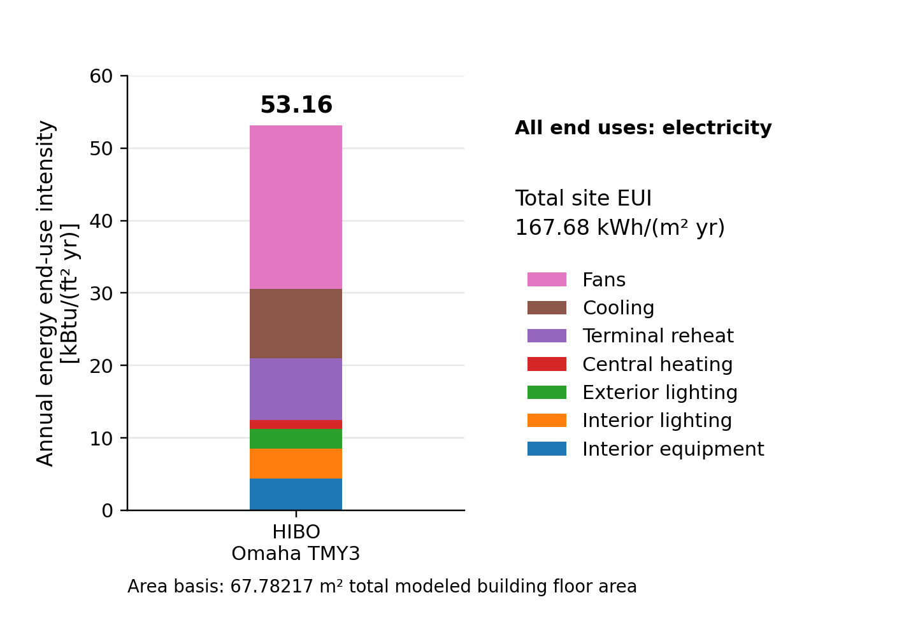

# HIBO EnergyPlus Building Model

Model Inputs and Simulation Results

Juhyun Bak | University of Nebraska–Lincoln

Model: 27 September 2026 | EnergyPlus 22.2.0

# 1. Model Overview

The Human-Centered Integrated Building Operation (HIBO) laboratory in Omaha, Nebraska, is modeled with three directly served thermal zones, a separate MEP zone, and a common return plenum. Lab A and Lab B are separate zones; the Lobby, Restroom, and Control rooms form one combined zone. One common air loop provides two-speed direct-expansion (DX) cooling and central electric heat, with a variable-air-volume (VAV) terminal and electric reheater for each served zone. [1,3]

**Table 1-1. HIBO model summary**

| Characteristic | Value / representation |
| --- | --- |
| Modeled total floor area | 67.782 m², including MEP; derived from floor polygons |
| Directly served floor area | 61.325 m² across three main zones |
| Stories / thermal zones | One occupied level plus plenum / five thermal zones |
| Typical occupied ceiling height | 3.048 m; restroom portion 2.7432 m |
| Main / rear roof elevations | 4.7244–4.5212 m / 4.0640–3.9624 m |
| Exterior walls | Metal-panel and CMU-veneer assemblies |
| Roof / floor | EPDM with insulation above metal deck / ground-contact concrete slab |
| Glazing | SN54 simple-glazing reference externally; 6.35 mm clear glass internally |
| Air system | One common VAV air loop with central DX cooling and electric heat |
| Terminal systems | Three VAV terminals, each with electric reheat |
| Shading / internal mass | Five parapet shading polygons / four central-zone mass objects |

Airflows and most coil capacities remain Autosize; the central electric heater is specified at 15 kW. The model combines drawing-based geometry, reference material properties, and operating assumptions; it has not been field-calibrated. [1,3,4]

# 2. Simulation Settings and Weather

## 2.1 Simulation Settings

The input specifies EnergyPlus version 22.2 and the supplied output identifies EnergyPlus 22.2.0-c249759bad. Zone and system sizing are enabled, plant sizing is disabled, and the annual weather-file run is enabled. Although separate design-day reporting is disabled, the seven SizingPeriod:DesignDay objects remain sizing inputs. [1,5]

**Table 2-1. Simulation settings**

| Setting | Input | IDF object |
| --- | --- | --- |
| EnergyPlus version | 22.2.0 (IDF version 22.2) | Version |
| Run period | January 1–December 31; year fields blank | RunPeriod |
| Start day / calendar | January 1 = Monday; weather-file holidays and daylight saving disabled | RunPeriod |
| Weather-file rain / snow indicators | Yes / Yes | RunPeriod |
| Zone / system / plant sizing | Yes / Yes / No | SimulationControl |
| Separate sizing-period simulation | No | SimulationControl |
| Weather-file annual simulation | Yes | SimulationControl |
| HVAC sizing simulation | No; maximum passes field = 3 | SimulationControl |
| Zone timestep | 6 per hour (10 minutes) | Timestep |
| Minimum HVAC timestep | 1 minute | ConvergenceLimits |
| Maximum HVAC iterations | 100 | ConvergenceLimits |
| Plant iteration limits | Minimum 2; maximum 8 | ConvergenceLimits |
| Warmup days | Minimum 6; maximum 25 | Building |
| Loads / temperature convergence tolerance | 0.04 / 0.4°C | Building |
| Envelope heat balance | ConductionTransferFunction | HeatBalanceAlgorithm |
| Surface-temperature upper limit | 200°C | HeatBalanceAlgorithm |
| Inside / outside convection | TARP / TARP | SurfaceConvectionAlgorithm:* |
| Solar distribution | FullExterior | Building |
| Shadow calculation | PolygonClipping; SutherlandHodgman | ShadowCalculation |
| Shadow update | Periodic; every 20 days | ShadowCalculation |
| Shadow overlap maximum | 15,000 figures | ShadowCalculation |
| Diffuse-sky treatment | SimpleSkyDiffuseModeling | ShadowCalculation |

Source: [1, L20–L95, L323–L336]. The shadow-calculation Pixel Counting Resolution is 512 although the selected method is PolygonClipping; all three external-shadow/self-shading disable flags are No.

## 2.2 Weather File and Site

**Table 2-2. Weather and site inputs**

| Input | Value | Source |
| --- | --- | --- |
| EPW | USA_NE_Omaha-Eppley.Airfield.725500_TMY3.epw | Supplied file [2] |
| Station / data set | Omaha Eppley Airfield, NE, USA / TMY3 | EPW LOCATION header |
| WMO / latitude / longitude | 725500 / 41.32° / −95.90° | EPW LOCATION; Site:Location |
| Time zone / elevation | UTC−6 / 299 m | EPW LOCATION; Site:Location |
| Weather records | 8,760 hourly records | Counted in supplied EPW |
| Header data period | January 1–December 31; Sunday | EPW DATA PERIODS |
| Simulation calendar | January 1 = Monday; year fields blank | RunPeriod in IDF |
| Holidays / daylight saving | Disabled for the annual run | RunPeriod in IDF |
| Data provenance | NREL TMY Data Set (2008); generally 1973–2005 period of record | EPW COMMENTS 1 |

The RunPeriod calendar is the model input governing day-type schedules; it is not replaced here by the EPW header’s Sunday start-day label. TMY monthly records retain their source-year values. The filename date identifies the model snapshot, not the meteorological year. The weather file is selected directly in EP-Launch. [1,2]

## 2.3 Sizing Design Days

**Table 2-3. Sizing design-day inputs**

| Condition | Date | Max dry bulb [°C] | Daily range [°C] | Humidity input | Wind [m/s / °] | Source |
| --- | --- | --- | --- | --- | --- | --- |
| Ann Clg .4% Condns DB=>MWB | 7/21 | 35 | 11 | Wetbulb 24.5°C | 6.1 / 180 | [1, L110–L138] |
| Ann Clg .4% Condns DP=>MDB | 7/21 | 29.7 | 11 | Dewpoint 24.5°C | 6.1 / 180 | [1, L140–L168] |
| Ann Clg .4% Condns Enth=>MDB | 7/21 | 32 | 11 | Enthalpy 82600 J/kg | 6.1 / 180 | [1, L170–L198] |
| Ann Clg .4% Condns WB=>MDB | 7/21 | 32 | 11 | Wetbulb 26.1°C | 6.1 / 180 | [1, L200–L228] |
| Ann Htg 99.6% Condns DB | 1/21 | -21.3 | 0 | Wetbulb -21.3°C | 4.5 / 340 | [1, L230–L258] |
| Ann Htg Wind 99.6% Condns WS=>MCDB | 1/21 | -8.6 | 0 | Wetbulb -8.6°C | 13.8 / 340 | [1, L260–L288] |
| Ann Hum_n 99.6% Condns DP=>MCDB | 1/21 | -20.6 | 0 | Dewpoint -25.4°C | 4.5 / 340 | [1, L290–L318] |

All seven design days use 97,784 Pa and DefaultMultipliers; rain, snow, and daylight saving are No. The four summer records use ASHRAETau with beam/diffuse optical depths 0.421 / 2.196. The three winter records use ASHRAEClearSky and sky clearness 0. The remaining blank solar and humidity schedules remain empty. [1, L110–L318]

# 3. Geometry and Zoning

![Figure 3-1. Modeled zone layout derived from the current IDF floor vertices. The common plenum is above the occupied plan. [1]](../docs/assets/model-footprints.png)

*Figure 3-1. Modeled zone layout derived from the current IDF floor vertices. The common plenum is above the occupied plan. [1]*

**Table 3-1. Zone and architectural-room correspondence**

| IDF zone | Drawing room(s) | Floor/footprint area [m²] | Volume [m³] | Representation |
| --- | --- | --- | --- | --- |
| Thermal Zone: Space 101 | Lab B / room 103 | 18.414 | 56.13 | Dedicated VAV + reheat |
| Thermal Zone: Space 102 - Plus | Lobby 101 + Restroom 102 + Control 104 | 24.497 | 72.81 | One combined zone; VAV + reheat |
| Thermal Zone: Space 103 | Lab A / room 105 | 18.414 | 56.13 | Dedicated VAV + reheat |
| MEP | MEP / room 106 | 6.457 | 19.68 | No dedicated terminal |
| Thermal Zone: Plenum | Common return plenum | 67.782 | 98.50 | Above the rooms; not counted in floor-area total |

The IDF’s Space 101 is drawing Lab B, room 103; it is not drawing Lobby 101. The three central architectural rooms share one simulated air temperature. The plenum footprint is not added again to building floor area. The MEP room has no dedicated air terminal. Model polygon area is not the same quantity as the architectural cover sheet’s gross building area. [1,3]

**Table 3-2. Zone extents and enclosed volumes calculated from surface vertices**

| Zone | Model-coordinate extent x × y [m] | Vertical extent [m] | Modeled volume [m³] |
| --- | --- | --- | --- |
| MEP | 6.312–9.171 × 4.654–6.913 | 0.000–3.048 | 19.682 |
| Thermal Zone: Plenum | 0.000–11.000 × 0.000–6.913 | 2.743–4.724 | 98.495 |
| Thermal Zone: Space 101 | 0.000–3.956 × 0.000–4.654 | 0.000–3.048 | 56.125 |
| Thermal Zone: Space 102 - Plus | 1.829–7.044 × 0.000–6.913 | 0.000–3.048 | 72.806 |
| Thermal Zone: Space 103 | 7.044–11.000 × 0.000–4.654 | 0.000–3.048 | 56.125 |

The central-zone extent is a bounding rectangle, not a statement that the zone itself is rectangular. Exact vertices, surface assignments, and reciprocal adjacent-surface names are supplied in the IDF and the complete input register. [1]

**Table 3-3. Geometry conventions and boundaries**

| Geometry input | Value / treatment |
| --- | --- |
| Coordinate system | Relative; counterclockwise vertices; UpperLeftCorner |
| Zone origins / zone rotations | All zero |
| Building North Axis | 333° |
| Main occupied ceiling | 3.048 m; restroom portion 2.7432 m |
| Main roof elevations | 4.7244–4.5212 m |
| Rear roof elevations | 4.0640–3.9624 m |
| Building surfaces | 67 BuildingSurface:Detailed objects |
| Openings and opaque opening pieces | 108 FenestrationSurface:Detailed objects; includes doors, frames, mullions and spandrels |
| Shading | 5 Shading:Building:Detailed parapet objects |
| Internal mass | 4 InternalMass objects in the combined central zone |
| Outside surfaces | Outdoors boundary |
| Ground-contact slabs | Ground boundary; Section 4.3 temperatures |
| Interior partitions / ceilings | Paired Surface boundaries to adjacent zone or plenum |

The listed zone origins and zone rotations are zero. Surface and opening names are retained from the IDF. Outdoors, Ground, and paired Surface boundaries are kept distinct. Ground-contact boundary temperatures are given in Section 4.3; construction assignments are given in Section 4. [1]

## 3.1 Openings, Frames, and Shading

The 108 FenestrationSurface:Detailed objects include transparent openings and explicit opaque opening pieces. They should not be counted as 108 transparent windows. Some exterior and interior frame strips, door pieces, and spandrels are represented as opaque Door-type subsurfaces. The two frame-and-divider objects are used for the principal south vision windows. [1]

**Table 3-4. Principal south vision window polygons**

| Window object | Vertex polygon width × height [m] | Frame/divider object | Source |
| --- | --- | --- | --- |
| HIBO CWC LabB Vision | 3.5560 × 2.5400 | HIBO CWC Vision Frame | [1, L3194–L3215] |
| HIBO CWB Control Vision | 1.1176 × 2.5400 | HIBO CWB Vision Frame | [1, L3217–L3238] |
| HIBO CWC LabA Vision | 3.5560 × 2.5400 | HIBO CWC Vision Frame | [1, L3240–L3261] |

The polygon dimensions are not interchangeable with clear-glass area or frame-inclusive opening area. The glazing, explicit frame-strip constructions, and FrameAndDivider inputs are documented separately in Section 4.5. The five Shading:Building:Detailed objects represent the South, West, East, Northwest Shoulder, and Northeast Shoulder upper parapets. Their transmittance-schedule fields are blank; the exact vertices are retained in the complete register. [1]

## 3.2 Internal Partitions and Same-Zone Mass

Interzone partitions and ceilings use paired Surface boundaries. Partitions and doors separating rooms that have been combined into the central thermal zone are instead represented by InternalMass objects with half-layer constructions and the entered exposed areas. These mass areas are not additional floor area. No explicit door-opening airflow is assigned. [1]

**Table 3-5. Central-zone internal mass**

| Object | Construction | Entered surface area [m²] |
| --- | --- | --- |
| HIBO Same-Zone Partition 104 | HIBO Internal Mass Half SA6 | 14.920228 |
| HIBO Same-Zone Door 104 | HIBO Internal Mass Half HM Door | 3.901928 |
| HIBO Same-Zone Partition 102 | HIBO Internal Mass Half SA6 | 11.650041 |
| HIBO Same-Zone Door 102 | HIBO Internal Mass Half HM Door | 3.901928 |

# 4. Envelope Materials and Constructions

Opaque heat-transfer surfaces use layer-by-layer Construction definitions. The exterior surface film is not inserted as a material layer; the model selects TARP for both inside and outside surface convection. FullExterior solar distribution and the shading settings in Section 2.1 are used. Equivalent materials remain explicit model representations rather than implied product tests. [1]

## 4.1 Exterior Walls

The metal-panel exterior wall has six layers from exterior to interior: equivalent sheet-metal skin, continuous insulation, an air-barrier resistance, exterior gypsum sheathing, an effective steel-stud/batt cavity, and interior Type X gypsum. The CMU-veneer wall has seven layers, with equivalent hollow CMU and a drainage cavity outside the same insulated/sheathing/cavity/gypsum sequence. The assemblies follow the drawing descriptions while the thermal tuples and equivalents are those entered in the IDF. [1,3]

## 4.2 Roofs

The roof uses EPDM membrane, four-inch R-30-equivalent polyisocyanurate, a resistance-only vapor-retarder layer, and equivalent metal decking. The modeled roof is sloped using surface vertices; the roof insulation layer remains 0.1016 m in the material definition. Material thickness is therefore not inferred from the elevation difference. [1,3]

## 4.3 Slab-on-Grade Floors

Both slab constructions start at the ground side with 0.1016 m granular fill followed by 0.1016 m concrete. The carpeted slab adds a 0.005207 m carpet-tile equivalent on the room side. Sealed-concrete floors do not add a separate massive sealer layer. All slab exterior boundaries are Ground, using the twelve monthly temperatures below; no Foundation:Kiva object is present. [1,3]

**Table 4-1. Prescribed ground-contact temperatures**

| Month | Ground temperature [°C] |
| --- | --- |
| January | 21.5 |
| February | 21.4 |
| March | 21.5 |
| April | 21.5 |
| May | 22 |
| June | 22.9 |
| July | 23 |
| August | 23.1 |
| September | 23.1 |
| October | 22.2 |
| November | 21.7 |
| December | 21.6 |

These temperatures belong to Site:GroundTemperature:BuildingSurface in the IDF. The separate ground-temperature information at several depths in the EPW header is not substituted for them. The source records do not establish these monthly boundary values as field measurements. [1,2]

## 4.4 Interior Partitions, Ceilings, and Construction Totals

Interior partitions use gypsum layers around six-inch or eight-inch effective sound-batt cavities. The suspended acoustic ceiling is represented by an Armstrong ULTIMA High NRC 1940 reference material; this reference item is not asserted to be the installed SKU. A separate gypsum ceiling construction is also used. Doors, frame strips, spandrels and same-zone half constructions have their own records. [1,3]

**Table 4-2. All 17 construction definitions**

| Construction | Layers: exterior / adjacent side → room side |
| --- | --- |
| EXT_Window_SN54 | SN54_1in_IGU |
| HIBO Metal Panel Exterior Wall | Metal Wall Panel 24ga Eq → Thermax CI R7.5 Eq → Air Barrier Eq → Exterior Gypsum Sheathing 5-8in → CFS Batt R13 6in Effective → Gypsum Board Type X 5-8in |
| HIBO CMU Veneer Exterior Wall | Burnished CMU Veneer 4in Eq → Exterior Drainage Cavity → Thermax CI R7.5 Eq → Air Barrier Eq → Exterior Gypsum Sheathing 5-8in → CFS Batt R13 6in Effective → Gypsum Board Type X 5-8in |
| HIBO EPDM Insulated Roof | EPDM Membrane 45mil → Roof Polyiso 4in R30 Eq → Roof Vapor Retarder Eq → Metal Roof Deck Eq |
| HIBO Slab Carpet | Granular Fill 4in Eq → Concrete Slab 4in → Carpet Tile CPT-1 Eq |
| HIBO Slab Sealed Concrete | Granular Fill 4in Eq → Concrete Slab 4in |
| HIBO APC-1 Ceiling | APC-1 Ultima High NRC 1940 Reference |
| HIBO GYP Ceiling | Gypsum Board Type X 5-8in |
| HIBO Interior Partition SA.6.20 | Gypsum Board Type X 5-8in → Interior Sound Batt Cavity 6in Eq → Gypsum Board Type X 5-8in |
| HIBO Interior Partition SA.8.21 | Gypsum Board Type X 5-8in → Interior Sound Batt Cavity 8in Eq → Gypsum Board Type X 5-8in |
| HIBO Interior CTG | Interior CTG 1-4in |
| HIBO HM Door 1-3-4in | HM Door Steel Skin Eq → HM Door Core Eq → HM Door Steel Skin Eq |
| HIBO Metal Frame Strip | Hollow Metal Frame Eq |
| HIBO Exterior Aluminum Frame Strip | Exterior Aluminum Frame Strip Eq |
| HIBO Internal Mass Half SA6 | Internal Mass Half Cavity SA6 Eq → Gypsum Board Type X 5-8in |
| HIBO Internal Mass Half HM Door | Internal Mass Half HM Core → HM Door Steel Skin Eq |
| HIBO ITSG Opaque Panel | ITSG Opaque Panel 1in Eq |

**Table 4-3. Calculated construction resistance and areal heat capacity**

| Opaque construction | R, no films [m² K/W] | C_A [kJ/(m² K)] |
| --- | --- | --- |
| HIBO Metal Panel Exterior Wall | 2.576922 | 36.207 |
| HIBO CMU Veneer Exterior Wall | 2.917107 | 101.279 |
| HIBO EPDM Insulated Roof | 5.288905 | 9.126 |
| HIBO Slab Carpet | 0.217755 | 338.816 |
| HIBO Slab Sealed Concrete | 0.130972 | 336.746 |
| HIBO APC-1 Ceiling | 0.390000 | 3.284 |
| HIBO GYP Ceiling | 0.099219 | 13.843 |
| HIBO Interior Partition SA.6.20 | 1.468437 | 31.953 |
| HIBO Interior Partition SA.8.21 | 1.891771 | 33.376 |
| HIBO HM Door 1-3-4in | 0.353794 | 11.220 |
| HIBO Metal Frame Strip | 0.200000 | 5.556 |
| HIBO Exterior Aluminum Frame Strip | 0.200000 | 16.459 |
| HIBO Internal Mass Half SA6 | 0.734219 | 15.977 |
| HIBO Internal Mass Half HM Door | 0.176897 | 5.610 |
| HIBO ITSG Opaque Panel | 0.418235 | 8.534 |

Source: [1, L1296–L1387]. Calculations use R = Σ(t/k) plus resistance-only layers and C_A = Σ(tρcₚ)/1000. NoMass and AirGap layers add their entered resistance but no explicit material heat capacity to this calculation. Glazing is not treated as an opaque massive layer. For slabs, the listed heat capacity includes the modeled granular-fill layer. These construction totals are not a single whole-building equivalent R or C.

## 4.5 Glazing, Frames, Doors, and Spandrel

The exterior SN54 simple-glazing record specifies glazing performance; it is not the frame-inclusive whole-window result. Interior clear glass uses a detailed spectral-average optical record. The main CWB/CWC windows use FrameAndDivider objects, while many other frames are explicit opaque strips. Insulated spandrels are opaque panels, not solar-transmitting glass. [1]

**Table 4-4. Glazing thermal and optical inputs**

| Glazing record | Property | Input | Source / basis |
| --- | --- | --- | --- |
| SN54_1in_IGU | U-factor [W/(m²K)] | 1.36 | Guardian SN54 on clear, double-glazed reference |
| SN54_1in_IGU | SHGC / visible transmittance | 0.28 / 0.54 | Guardian SN54 reference |
| HIBO Interior CTG 1-4in | Thickness [mm] | 6.35 | A0.1 §088000: 1/4 in clear tempered glass |
| HIBO Interior CTG 1-4in | Conductivity [W/(mK)] | 0.9 | EnergyPlus 22.2 WindowGlassMaterials: CLEAR 6MM reference |
| HIBO Interior CTG 1-4in | Solar transmittance / front and back reflectance | 0.775 / 0.071 / 0.071 | CLEAR 6MM reference |
| HIBO Interior CTG 1-4in | Visible transmittance / front and back reflectance | 0.881 / 0.08 / 0.08 | CLEAR 6MM reference |
| HIBO Interior CTG 1-4in | IR transmittance / front and back emissivity | 0 / 0.84 / 0.84 | CLEAR 6MM reference |
| HIBO Interior CTG 1-4in | Optical data / dirt factor / solar diffusing | SpectralAverage / 1 / No | IDF settings |

**Table 4-5. Main window frame and divider inputs**

| Input | CWB Vision Frame | CWC Vision Frame |
| --- | --- | --- |
| Frame width | 0.0508 m | 0.0508 m |
| Frame conductance | 5.0 W/(m²K) | 5.0 W/(m²K) |
| Frame inside/outside projection | 0.0 / 0.0 m | 0.0 / 0.0 m |
| Frame edge-to-center conductance ratio | 1.3 | 1.3 |
| Frame solar / visible absorptance / emissivity | 0.40 / 0.40 / 0.90 | 0.40 / 0.40 / 0.90 |
| Divider type / width | DividedLite / 0.0508 m | DividedLite / 0.0508 m |
| Horizontal / vertical divider count | 2 / 0 | 2 / 3 |
| Divider inside/outside projection | 0.0 / 0.0 m | 0.0 / 0.0 m |
| Divider conductance / edge ratio | 5.0 W/(m²K) / 1.3 | 5.0 W/(m²K) / 1.3 |
| Divider solar / visible absorptance / emissivity | 0.40 / 0.40 / 0.90 | 0.40 / 0.40 / 0.90 |
| Outside reveal solar absorptance | 0.50 | 0.50 |
| Inside sill depth / solar absorptance | 0.0 m / 0.50 | 0.0 m / 0.50 |
| Inside reveal depth / solar absorptance | 0.0 m / 0.50 | 0.0 m / 0.50 |

Sources: [1, L1266–L1291, L5681–L5735]. The 5 W/(m² K) frame/divider conductance, 1.3 edge ratios, and explicit strip equivalents are model inputs, not certified installed assembly performance. Opaque frame strips use their own assumed layer properties, while the detailed exterior simple-glazing model and internal glass are independent material records.

## 4.6 Material Properties and Sources

Tables 4-6 through 4-27 list material thickness, conductivity, density, specific heat, and surface properties with the source recorded for each value. Equivalent layers and generic reference properties are identified in the corresponding rows; they are not installed-product certifications. [1,3]

**Table 4-6. HIBO Metal Wall Panel 24ga Eq**

| Property | Input | Unit | Source / basis |
| --- | --- | --- | --- |
| Thickness | 0.61 | mm | Equivalent skin thickness; not independently verified gauge |
| Conductivity | 45.28 | W/(m K) | [ASHRAE HOF F08 generic steel](https://github.com/NatLabRockies/EnergyPlus/blob/v22.2.0/datasets/ASHRAE_2005_HOF_Materials.idf) |
| Density | 7824 | kg/m³ | [ASHRAE HOF F08 generic steel](https://github.com/NatLabRockies/EnergyPlus/blob/v22.2.0/datasets/ASHRAE_2005_HOF_Materials.idf) |
| Specific heat | 500 | J/(kg K) | [ASHRAE HOF F08 generic steel](https://github.com/NatLabRockies/EnergyPlus/blob/v22.2.0/datasets/ASHRAE_2005_HOF_Materials.idf) |
| Roughness | Smooth | — | IDF surface setting |
| Absorptance: thermal / solar / visible | 0.9 / 0.7 / 0.7 | — | IDF surface settings |

[1, L685–L694].

**Table 4-7. HIBO Burnished CMU Veneer 4in Eq**

| Property | Input | Unit | Source / basis |
| --- | --- | --- | --- |
| Thickness | 92.1 | mm | 4 in hollow-wall equivalent |
| Conductivity | 0.484229679367 | W/(m K) | [CMHA TEK 06-02C, derived t/R without films](https://www.cmha.org/resource/tek-06-02c/) |
| Density | 832.318730782 | kg/m³ | [CMHA TEK 06-16A heat capacity, derived bulk-effective density](https://www.cmha.org/resource/tek-06-16a/) |
| Specific heat | 880 | J/(kg K) | [CMHA TEK 06-16A masonry reference](https://www.cmha.org/resource/tek-06-16a/) |
| Roughness | MediumRough | — | IDF surface setting |
| Absorptance: thermal / solar / visible | 0.9 / 0.7 / 0.7 | — | IDF surface settings |

[1, L718–L727].

**Table 4-8. HIBO Thermax CI R7.5 Eq**

| Property | Input | Unit | Source / basis |
| --- | --- | --- | --- |
| Thickness | 27.2 | mm | [A0.1 R-7.5 equivalent / DuPont THERMAX R-7 per inch](https://www.dupont.com/products/thermax-sheathing.html) |
| Conductivity | 0.0205931898624 | W/(m K) | Derived from A0.1 R-7.5 and modeled thickness |
| Density | 32 | kg/m³ | [ASHRAE HOF faced-polyiso generic reference](https://github.com/NatLabRockies/EnergyPlus/blob/v22.2.0/datasets/ASHRAE_2005_HOF_Materials.idf) |
| Specific heat | 920 | J/(kg K) | [ASHRAE HOF faced-polyiso generic reference](https://github.com/NatLabRockies/EnergyPlus/blob/v22.2.0/datasets/ASHRAE_2005_HOF_Materials.idf) |
| Roughness | MediumRough | — | IDF surface setting |
| Absorptance: thermal / solar / visible | 0.9 / 0.7 / 0.7 | — | IDF surface settings |

[1, L745–L754].

**Table 4-9. HIBO Exterior Gypsum Sheathing 5-8in**

| Property | Input | Unit | Source / basis |
| --- | --- | --- | --- |
| Thickness | 15.875 | mm | A1.1/A1.2: 5/8 in |
| Conductivity | 0.16 | W/(m K) | [ASHRAE HOF G01/G01a generic gypsum](https://github.com/NatLabRockies/EnergyPlus/blob/v22.2.0/datasets/ASHRAE_2005_HOF_Materials.idf) |
| Density | 800 | kg/m³ | [ASHRAE HOF G01/G01a generic gypsum](https://github.com/NatLabRockies/EnergyPlus/blob/v22.2.0/datasets/ASHRAE_2005_HOF_Materials.idf) |
| Specific heat | 1090 | J/(kg K) | [ASHRAE HOF G01/G01a generic gypsum](https://github.com/NatLabRockies/EnergyPlus/blob/v22.2.0/datasets/ASHRAE_2005_HOF_Materials.idf) |
| Roughness | MediumSmooth | — | IDF surface setting |
| Absorptance: thermal / solar / visible | 0.9 / 0.4 / 0.4 | — | IDF surface settings |

[1, L774–L783].

**Table 4-10. HIBO CFS Batt R13 6in Effective**

| Property | Input | Unit | Source / basis |
| --- | --- | --- | --- |
| Thickness | 152.4 | mm | A1.2: 6 in framing |
| Conductivity | 0.14423 | W/(m K) | Assumed effective steel/batt cavity resistance ≈ R-6 (IP) |
| Density | 50 | kg/m³ | Assumed effective composite density |
| Specific heat | 700 | J/(kg K) | Assumed effective composite specific heat |
| Roughness | MediumRough | — | IDF surface setting |
| Absorptance: thermal / solar / visible | 0.9 / 0.5 / 0.5 | — | IDF surface settings |

[1, L795–L804].

**Table 4-11. HIBO Gypsum Board Type X 5-8in**

| Property | Input | Unit | Source / basis |
| --- | --- | --- | --- |
| Thickness | 15.875 | mm | A1.1/A1.2: 5/8 in Type X |
| Conductivity | 0.16 | W/(m K) | [ASHRAE HOF G01/G01a generic gypsum](https://github.com/NatLabRockies/EnergyPlus/blob/v22.2.0/datasets/ASHRAE_2005_HOF_Materials.idf) |
| Density | 800 | kg/m³ | [ASHRAE HOF G01/G01a generic gypsum](https://github.com/NatLabRockies/EnergyPlus/blob/v22.2.0/datasets/ASHRAE_2005_HOF_Materials.idf) |
| Specific heat | 1090 | J/(kg K) | [ASHRAE HOF G01/G01a generic gypsum](https://github.com/NatLabRockies/EnergyPlus/blob/v22.2.0/datasets/ASHRAE_2005_HOF_Materials.idf) |
| Roughness | MediumSmooth | — | IDF surface setting |
| Absorptance: thermal / solar / visible | 0.9 / 0.4 / 0.4 | — | IDF surface settings |

[1, L824–L833].

**Table 4-12. HIBO EPDM Membrane 45mil**

| Property | Input | Unit | Source / basis |
| --- | --- | --- | --- |
| Thickness | 1.143 | mm | A0.1 §075323: 45 mil EPDM |
| Conductivity | 0.25 | W/(m K) | [EN 12524:2000, Table 1 EPDM reference](https://nobelcert.com/DataFiles/FreeUpload/EN%2012524-2000.pdf) |
| Density | 1150 | kg/m³ | [EN 12524:2000, Table 1 EPDM reference](https://nobelcert.com/DataFiles/FreeUpload/EN%2012524-2000.pdf) |
| Specific heat | 1000 | J/(kg K) | [EN 12524:2000, Table 1 EPDM reference](https://nobelcert.com/DataFiles/FreeUpload/EN%2012524-2000.pdf) |
| Roughness | VeryRough | — | IDF surface setting |
| Absorptance: thermal / solar / visible | 0.9 / 0.7 / 0.7 | — | IDF surface settings |

[1, L852–L861].

**Table 4-13. HIBO Roof Polyiso 4in R30 Eq**

| Property | Input | Unit | Source / basis |
| --- | --- | --- | --- |
| Thickness | 101.6 | mm | A1.2: 4 in roof insulation |
| Conductivity | 0.0192304052391 | W/(m K) | Derived to preserve A0.1 R-30 target |
| Density | 32 | kg/m³ | [ASHRAE HOF faced-polyiso generic reference](https://github.com/NatLabRockies/EnergyPlus/blob/v22.2.0/datasets/ASHRAE_2005_HOF_Materials.idf) |
| Specific heat | 920 | J/(kg K) | [ASHRAE HOF faced-polyiso generic reference](https://github.com/NatLabRockies/EnergyPlus/blob/v22.2.0/datasets/ASHRAE_2005_HOF_Materials.idf) |
| Roughness | MediumRough | — | IDF surface setting |
| Absorptance: thermal / solar / visible | 0.9 / 0.7 / 0.7 | — | IDF surface settings |

[1, L878–L887].

**Table 4-14. HIBO Metal Roof Deck Eq**

| Property | Input | Unit | Source / basis |
| --- | --- | --- | --- |
| Thickness | 1.5 | mm | [EnergyPlus 22.2 DOE reference: Metal Decking](https://github.com/NatLabRockies/EnergyPlus/blob/v22.2.0/testfiles/RefBldgMediumOfficeNew2004_Chicago.idf) |
| Conductivity | 45.006 | W/(m K) | [EnergyPlus 22.2 DOE reference: Metal Decking](https://github.com/NatLabRockies/EnergyPlus/blob/v22.2.0/testfiles/RefBldgMediumOfficeNew2004_Chicago.idf) |
| Density | 7680 | kg/m³ | [EnergyPlus 22.2 DOE reference: Metal Decking](https://github.com/NatLabRockies/EnergyPlus/blob/v22.2.0/testfiles/RefBldgMediumOfficeNew2004_Chicago.idf) |
| Specific heat | 418.4 | J/(kg K) | [EnergyPlus 22.2 DOE reference: Metal Decking](https://github.com/NatLabRockies/EnergyPlus/blob/v22.2.0/testfiles/RefBldgMediumOfficeNew2004_Chicago.idf) |
| Roughness | MediumSmooth | — | IDF surface setting |
| Absorptance: thermal / solar / visible | 0.9 / 0.7 / 0.3 | — | IDF surface settings |

[1, L908–L917].

**Table 4-15. HIBO Concrete Slab 4in**

| Property | Input | Unit | Source / basis |
| --- | --- | --- | --- |
| Thickness | 101.6 | mm | A1.2: 4 in concrete slab |
| Conductivity | 1.311 | W/(m K) | [EnergyPlus 22.2 DOE reference: MAT-CC05](https://github.com/NatLabRockies/EnergyPlus/blob/v22.2.0/testfiles/RefBldgMediumOfficeNew2004_Chicago.idf) |
| Density | 2240 | kg/m³ | [EnergyPlus 22.2 DOE reference: MAT-CC05](https://github.com/NatLabRockies/EnergyPlus/blob/v22.2.0/testfiles/RefBldgMediumOfficeNew2004_Chicago.idf) |
| Specific heat | 836.8 | J/(kg K) | [EnergyPlus 22.2 DOE reference: MAT-CC05](https://github.com/NatLabRockies/EnergyPlus/blob/v22.2.0/testfiles/RefBldgMediumOfficeNew2004_Chicago.idf) |
| Roughness | Rough | — | IDF surface setting |
| Absorptance: thermal / solar / visible | 0.9 / 0.7 / 0.7 | — | IDF surface settings |

[1, L937–L946].

**Table 4-16. HIBO Granular Fill 4in Eq**

| Property | Input | Unit | Source / basis |
| --- | --- | --- | --- |
| Thickness | 101.6 | mm | A1.2: 4 in granular fill |
| Conductivity | 1.9 | W/(m K) | [EnergyPlus 22.2 Basement material reference: gravel](https://github.com/NatLabRockies/EnergyPlus/blob/v22.2.0/doc/auxiliary-programs/src/ground-heat-transfer-in-energyplus/description-of-the-objects-in-the-basementght.tex) |
| Density | 2000 | kg/m³ | [EnergyPlus 22.2 Basement material reference: gravel](https://github.com/NatLabRockies/EnergyPlus/blob/v22.2.0/doc/auxiliary-programs/src/ground-heat-transfer-in-energyplus/description-of-the-objects-in-the-basementght.tex) |
| Specific heat | 720 | J/(kg K) | [EnergyPlus 22.2 Basement material reference: gravel](https://github.com/NatLabRockies/EnergyPlus/blob/v22.2.0/doc/auxiliary-programs/src/ground-heat-transfer-in-energyplus/description-of-the-objects-in-the-basementght.tex) |
| Roughness | Rough | — | IDF surface setting |
| Absorptance: thermal / solar / visible | 0.9 / 0.7 / 0.7 | — | IDF surface settings |

[1, L965–L974].

**Table 4-17. HIBO APC-1 Ultima High NRC 1940 Reference**

| Property | Input | Unit | Source / basis |
| --- | --- | --- | --- |
| Thickness | 22.225 | mm | [Armstrong ULTIMA High NRC 1940 reference: 7/8 in](https://www.armstrongceilings.com/content/dam/armstrongceilings/commercial/north-america/data-sheets/data-sheet-ultima-square-lay-in.pdf) |
| Conductivity | 0.0569871794872 | W/(m K) | [Derived t/R from manufacturer reference R = 0.39 m²K/W](https://www.armstrongceilings.com/content/dam/armstrongceilings/commercial/north-america/data-sheets/data-sheet-ultima-square-lay-in.pdf) |
| Density | 250.437233092 | kg/m³ | [Derived from manufacturer reference areal weight](https://www.armstrongceilings.com/content/dam/armstrongceilings/commercial/north-america/data-sheets/data-sheet-ultima-square-lay-in.pdf) |
| Specific heat | 590 | J/(kg K) | [ASHRAE HOF F16 generic acoustic tile](https://github.com/NatLabRockies/EnergyPlus/blob/v22.2.0/datasets/ASHRAE_2005_HOF_Materials.idf) |
| Roughness | MediumSmooth | — | IDF surface setting |
| Absorptance: thermal / solar / visible | 0.9 / 0.3 / 0.13 | — | IDF surface settings |

[1, L994–L1003].

**Table 4-18. HIBO Interior Sound Batt Cavity 6in Eq**

| Property | Input | Unit | Source / basis |
| --- | --- | --- | --- |
| Thickness | 152.4 | mm | A1.1: SA.6.20 framing tag |
| Conductivity | 0.12 | W/(m K) | Assumed effective cavity |
| Density | 40 | kg/m³ | Assumed composite density |
| Specific heat | 700 | J/(kg K) | Assumed composite specific heat |
| Roughness | MediumRough | — | IDF surface setting |
| Absorptance: thermal / solar / visible | 0.9 / 0.5 / 0.5 | — | IDF surface settings |

[1, L1015–L1024].

**Table 4-19. HIBO Interior Sound Batt Cavity 8in Eq**

| Property | Input | Unit | Source / basis |
| --- | --- | --- | --- |
| Thickness | 203.2 | mm | A1.1: SA.8.21 tag interpretation; schedule thickness conflicts |
| Conductivity | 0.12 | W/(m K) | Assumed effective cavity |
| Density | 40 | kg/m³ | Assumed composite density |
| Specific heat | 700 | J/(kg K) | Assumed composite specific heat |
| Roughness | MediumRough | — | IDF surface setting |
| Absorptance: thermal / solar / visible | 0.9 / 0.5 / 0.5 | — | IDF surface settings |

[1, L1036–L1045].

**Table 4-20. HIBO HM Door Steel Skin Eq**

| Property | Input | Unit | Source / basis |
| --- | --- | --- | --- |
| Thickness | 1 | mm | Assumed 1 mm steel skin |
| Conductivity | 45.28 | W/(m K) | [ASHRAE HOF F08 generic steel](https://github.com/NatLabRockies/EnergyPlus/blob/v22.2.0/datasets/ASHRAE_2005_HOF_Materials.idf) |
| Density | 7824 | kg/m³ | [ASHRAE HOF F08 generic steel](https://github.com/NatLabRockies/EnergyPlus/blob/v22.2.0/datasets/ASHRAE_2005_HOF_Materials.idf) |
| Specific heat | 500 | J/(kg K) | [ASHRAE HOF F08 generic steel](https://github.com/NatLabRockies/EnergyPlus/blob/v22.2.0/datasets/ASHRAE_2005_HOF_Materials.idf) |
| Roughness | Smooth | — | IDF surface setting |
| Absorptance: thermal / solar / visible | 0.9 / 0.7 / 0.7 | — | IDF surface settings |

[1, L1065–L1074].

**Table 4-21. HIBO HM Door Core Eq**

| Property | Input | Unit | Source / basis |
| --- | --- | --- | --- |
| Thickness | 42.45 | mm | 44.45 mm leaf minus two assumed 1 mm skins |
| Conductivity | 0.12 | W/(m K) | Assumed unknown door core |
| Density | 80 | kg/m³ | Assumed unknown door core |
| Specific heat | 1000 | J/(kg K) | Assumed unknown door core |
| Roughness | Smooth | — | IDF surface setting |
| Absorptance: thermal / solar / visible | 0.9 / 0.5 / 0.5 | — | IDF surface settings |

[1, L1086–L1095].

**Table 4-22. HIBO Hollow Metal Frame Eq**

| Property | Input | Unit | Source / basis |
| --- | --- | --- | --- |
| Thickness | 44.45 | mm | Assumed equivalent frame depth |
| Conductivity | 0.22225 | W/(m K) | Derived from assumed layer R = 0.20 m²K/W |
| Density | 250 | kg/m³ | Assumed hollow-section bulk density |
| Specific heat | 500 | J/(kg K) | Generic steel specific-heat proxy |
| Roughness | Smooth | — | IDF surface setting |
| Absorptance: thermal / solar / visible | 0.9 / 0.4 / 0.4 | — | IDF surface settings |

[1, L1108–L1117].

**Table 4-23. HIBO Exterior Aluminum Frame Strip Eq**

| Property | Input | Unit | Source / basis |
| --- | --- | --- | --- |
| Thickness | 152.4 | mm | A0.1: nominal 6 in storefront-equivalent depth |
| Conductivity | 0.762 | W/(m K) | Derived from assumed layer R = 0.20 m²K/W |
| Density | 120 | kg/m³ | Assumed hollow-section bulk density |
| Specific heat | 900 | J/(kg K) | [NIST WebBook aluminum at 25°C; rounded](https://webbook.nist.gov/cgi/cbook.cgi?ID=C7429905&Mask=2) |
| Roughness | Smooth | — | IDF surface setting |
| Absorptance: thermal / solar / visible | 0.9 / 0.4 / 0.4 | — | IDF surface settings |

[1, L1130–L1139].

**Table 4-24. HIBO Internal Mass Half Cavity SA6 Eq**

| Property | Input | Unit | Source / basis |
| --- | --- | --- | --- |
| Thickness | 76.2 | mm | Half SA6 cavity |
| Conductivity | 0.12 | W/(m K) | Same assumed SA6 cavity |
| Density | 40 | kg/m³ | Same assumed SA6 cavity |
| Specific heat | 700 | J/(kg K) | Same assumed SA6 cavity |
| Roughness | Smooth | — | IDF surface setting |
| Absorptance: thermal / solar / visible | 0.9 / 0.5 / 0.5 | — | IDF surface settings |

[1, L1151–L1160].

**Table 4-25. HIBO Internal Mass Half HM Core**

| Property | Input | Unit | Source / basis |
| --- | --- | --- | --- |
| Thickness | 21.225 | mm | Half HM core |
| Conductivity | 0.12 | W/(m K) | Same assumed HM core |
| Density | 80 | kg/m³ | Same assumed HM core |
| Specific heat | 1000 | J/(kg K) | Same assumed HM core |
| Roughness | Smooth | — | IDF surface setting |
| Absorptance: thermal / solar / visible | 0.9 / 0.5 / 0.5 | — | IDF surface settings |

[1, L1172–L1181].

**Table 4-26. HIBO ITSG Opaque Panel 1in Eq**

| Property | Input | Unit | Source / basis |
| --- | --- | --- | --- |
| Thickness | 25.4 | mm | A0.1 §088000: 1 in opaque spandrel |
| Conductivity | 0.0607313642757 | W/(m K) | Derived from assumed U = 1.70 W/(m²K) and film R = 0.17 m²K/W |
| Density | 400 | kg/m³ | Assumed spandrel composite |
| Specific heat | 840 | J/(kg K) | Assumed spandrel composite |
| Roughness | Smooth | — | IDF surface setting |
| Absorptance: thermal / solar / visible | 0.84 / 0.6 / 0.6 | — | IDF surface settings |

[1, L1193–L1202].

**Table 4-27. HIBO Carpet Tile CPT-1 Eq**

| Property | Input | Unit | Source / basis |
| --- | --- | --- | --- |
| Thickness | 5.207 | mm | [J+J Kinetex 1840 reference: nominal 0.205 in](https://www.jjflooringgroup.com/product/against-the-grain-demi-plank/) |
| Conductivity | 0.06 | W/(m K) | [ASHRAE HOF F17 generic carpet](https://github.com/NatLabRockies/EnergyPlus/blob/v22.2.0/datasets/ASHRAE_2005_HOF_Materials.idf) |
| Density | 288 | kg/m³ | [ASHRAE HOF F17 generic carpet](https://github.com/NatLabRockies/EnergyPlus/blob/v22.2.0/datasets/ASHRAE_2005_HOF_Materials.idf) |
| Specific heat | 1380 | J/(kg K) | [ASHRAE HOF F17 generic carpet](https://github.com/NatLabRockies/EnergyPlus/blob/v22.2.0/datasets/ASHRAE_2005_HOF_Materials.idf) |
| Roughness | MediumRough | — | IDF surface setting |
| Absorptance: thermal / solar / visible | 0.9 / 0.7 / 0.7 | — | IDF surface settings |

[1, L1222–L1231].

The CFS/batt material’s name contains R13, but its entered conductivity represents an effective framed cavity rather than unbridged R-13 insulation. The CMU density is a bulk-effective hollow-assembly value. Interior batt cavities, door cores, frame strips, and spandrel composites retain their declared equivalent-property assumptions. These choices are not silently replaced by nominal material labels. [1]

**Table 4-28. Resistance-only material inputs**

| Layer | R [m²K/W] | Roughness | Thermal / solar / visible absorptance | Source / basis |
| --- | --- | --- | --- | --- |
| HIBO Air Barrier Eq | 0.001 | MediumSmooth | 0.90 / 0.50 / 0.50 | Thin-membrane modeling assumption; [1, L1237–L1243] |
| HIBO Roof Vapor Retarder Eq | 0.0010 | Smooth | 0.90 / 0.50 / 0.50 | Thin-membrane modeling assumption; [1, L1246–L1252] |
| HIBO Exterior Drainage Cavity | 0.15 | Not applicable | Not applicable | EnergyPlus 22.2 ASHRAE HOF F04 wall air space; [1, L1259–L1261] |

# 5. Occupancy, Lighting, and Equipment

## 5.1 Occupancy

Each of the three main zones has one People object, using the same area-per-person method, people multiplier, and activity schedule. Neither MEP nor the plenum has a People object. The occupancy inputs are schedule assumptions in the model, not measured occupant counts. [1]

**Table 5-1. People inputs common to the three main zones**

| Parameter | Input | Source / basis |
| --- | --- | --- |
| Calculation method | Area/Person | [1, L5859–L5902] |
| Floor area per person | 18.580626 m²/person | IDF occupancy-density input |
| Number-of-people schedule | `OCCUPY-1` | Schedule multiplier applied to area-based design count |
| Activity schedule | `ActSchd` | Activity level defined in Appendix A |
| Radiant fraction | 0.30 | IDF sensible-heat split input |
| Sensible heat fraction | Blank | Not assigned a constant value in the IDF |
| Mean radiant temperature calculation | ZoneAveraged | IDF setting |
| ASHRAE 55 comfort warnings | No | IDF setting |

**Table 5-2. Calculated design occupancy from area and activity inputs**

| Zone | Design people count | Full-schedule activity heat [W] |
| --- | --- | --- |
| Thermal Zone: Space 101 | 0.991 | 116.19 |
| Thermal Zone: Space 102 - Plus | 1.318 | 154.57 |
| Thermal Zone: Space 103 | 0.991 | 116.19 |

The calculated count is fractional because an area-per-person density is used. The activity heat is total metabolic heat before the solver determines the sensible/latent split; it is not all convective sensible gain. ActSchd is 117.239998 W/person all day. The sensible-heat-fraction field is blank, and the CO₂ generation-rate field is also blank. [1]

![Figure 5-1. OCCUPY-1 weekday and weekend profiles. Exact day-type and design-day values are in Appendix A.1. [1]](../docs/assets/occupancy.png)

*Figure 5-1. OCCUPY-1 weekday and weekend profiles. Exact day-type and design-day values are in Appendix A.1. [1]*

## 5.2 Electric Lighting

The three main zones each contain a Lights object using Watts/Area. The lighting density is multiplied by ltg_sch_office. No Daylighting:Controls object is instantiated, so the daylight availability at the windows does not imply an active daylight-dimming control. The plenum and MEP have no Lights objects. [1]

**Table 5-3. Interior lighting inputs**

| Parameter | Input | Source / basis |
| --- | --- | --- |
| Design-level method | Watts/Area | [1, L5907–L5950] |
| Lighting power density | 6.181254 W/m² | IDF load input |
| Schedule | `ltg_sch_office` | Appendix A |
| Return-air / radiant / visible fractions | 0 / 0.70 / 0.20 | IDF fractions; remainder 0.10 is convective |
| Fraction replaceable | 1 | IDF setting |
| End-use subcategory | LightsWired | IDF setting |

![Figure 5-2. Interior lighting schedule. The entered weekday maximum is about 0.571 of design power, not 1.0. [1]](../docs/assets/lighting.png)

*Figure 5-2. Interior lighting schedule. The entered weekday maximum is about 0.571 of design power, not 1.0. [1]*

**Table 5-4. Calculated zone design powers before schedule multipliers**

| Zone | Calculated design lighting [W] | Calculated design plug load [W] |
| --- | --- | --- |
| Thermal Zone: Space 101 | 113.82 | 124.85 |
| Thermal Zone: Space 102 - Plus | 151.42 | 166.09 |
| Thermal Zone: Space 103 | 113.82 | 124.85 |

Exterior_Lights_a is a separate 88.49 W load. Its schedule is zero from 00:00–06:00 and one from 06:00–24:00 for AllDays. The Control Option field is blank. The exterior load is not applied as a zone internal heat gain. [1, L498–L506, L6056–L6061]

## 5.3 Plug and Process Loads

One ElectricEquipment object is assigned to each main zone. Each uses a 6.78 W/m² design power and the EQUIP-1 schedule. The source does not enumerate individual laboratory devices or provide a measured plug-load inventory. Latent, radiant and lost fraction fields are blank, so the report does not substitute a measured heat split. [1]

**Table 5-5. Electric-equipment inputs**

| Parameter | Input | Source / basis |
| --- | --- | --- |
| Design-level method | Watts/Area | [1, L5955–L5992] |
| Equipment power density | 6.78 W/m² | IDF load input |
| Schedule | `EQUIP-1` | Appendix A |
| Latent / radiant / lost fractions | Blank / Blank / Blank | Fields are not explicitly entered; no measured heat split is asserted |
| End-use subcategory | MiscPlug | IDF setting |

![Figure 5-3. EQUIP-1 operating profile. Weekday, summer design-day and custom-day profiles share the plotted daytime curve. [1]](../docs/assets/equipment.png)

*Figure 5-3. EQUIP-1 operating profile. Weekday, summer design-day and custom-day profiles share the plotted daytime curve. [1]*

# 6. HVAC, Controls, and Air Exchange

## 6.1 System Arrangement

The air loop DXVAV Sys 1 serves all three main zones. Zone return nodes enter a common return plenum; air passes through a series return fan, outdoor/return-air mixer, DX cooling coil, central electric heater, supply fan, and zone splitter. Each branch then passes through a VAV damper and electric reheat coil before entering its zone. [1]

![Figure 6-1. Implemented common air loop and three terminal branches. The series return fan is a model component, not a verified equivalence to the nameplate power-exhaust arrangement. [1,4]](../docs/assets/hvac-airpath.png)

*Figure 6-1. Implemented common air loop and three VAV/reheat branches. [1]*

**Table 6-1. Terminal-to-zone mapping**

| Zone | Terminal name | Terminal reheat coil |
| --- | --- | --- |
| Thermal Zone: Space 101 | Thermal Zone: Space 101 VAV Reheat | Thermal Zone: Space 101 Reheat Coil |
| Thermal Zone: Space 102 - Plus | Thermal Zone: Space 102 - Plus VAV Reheat | Thermal Zone: Space 102 - Plus Reheat Coil |
| Thermal Zone: Space 103 | Thermal Zone: Space 103 VAV Reheat | Thermal Zone: Space 103 Reheat Coil |

SupplyPath, ReturnPath, Branch, BranchList, NodeList and ZoneHVAC equipment-connection objects implement this routing. Appendix B.1 gives the common node sequence and points to the full connection definitions. MEP has no dedicated supply terminal. [1]

## 6.2 Cooling and Electric Heating

**Table 6-2. Cooling and heating component inputs**

| Component / parameter | Input | Source / basis |
| --- | --- | --- |
| DX coil object | Coil:Cooling:DX:TwoSpeed / DXVAV Sys 1 Cooling Coil | [1, L6497–L6530] |
| High / low gross cooling capacity | Autosize / Autosize | Calculated by EnergyPlus; no fixed nameplate tonnage is entered |
| High / low rated airflow | Autosize / Autosize | IDF sizing inputs |
| High / low sensible heat ratio | Autosize / Autosize | IDF sizing inputs |
| High / low gross COP | 3.28 / 3.28 W/W | IDF performance inputs |
| Condenser type | AirCooled | IDF setting |
| Minimum compressor outdoor dry bulb | −25°C | IDF setting |
| DX coil availability schedule | Blank | No schedule name is entered in the coil object |
| Central electric heating coil | DXVAV Sys 1 Heating Coil | Coil:Heating:Electric |
| Central heating nominal capacity | 15,000 W | AAON RTU-1 nameplate: maximum electric heat 15 kW |
| Central heating efficiency / schedule | 1.0 / `AvailSched_1` | IDF input |
| Terminal electric reheaters | One coil per main zone; nominal capacity = Autosize | [1, L6535–L6566] |
| Terminal reheat efficiency / schedule | 1.0 / `AvailSched_1` | IDF input |

The DX coil uses gross COP 3.28 at both speeds and AirCooled condenser type. Internal static pressure, condenser-air-inlet name, evaporative-condenser fields, water tank references and basin-heater capacity are blank; the basin-heater setpoint field is 2°C. The associated CoilSystem:Cooling:DX has an empty availability-schedule name and connects the mixed-air and cooling-coil-outlet nodes. Its sensor node is the cooling-coil outlet; Dehumidification Control Type is None, Run on Sensible Load is Yes, and Run on Latent Load is No. Additional explicitly entered and blank fields are preserved in the complete input register. [1, L6497–L6530, L6571–L6581]

**Table 6-3. Equipment-source evidence versus implemented capacity inputs**

| Equipment evidence | Documented value | How it is used in this IDF |
| --- | --- | --- |
| Installed AAON RTU electric heat | 15 kW maximum output | Central nominal heating capacity = 15,000 W |
| Installed RTU field note | Reconfigured from 6 ton to 4 ton | Not imposed as a fixed DX cooling capacity; DX capacity remains Autosize |
| Nameplate maximum outlet-air temperature | 200°F | Rating on the central unit; not entered as a terminal DAT control limit |
| M1.1 terminal schedule TB-1 / TB-2 / TB-3 | 8.9 / 4.4 / 8.9 kW; 800 / 400 / 800 CFM maximum | Design evidence, not the current autosized terminal inputs |
| M1.1 RTU basis of design | Daikin DPS005A | Different evidence from the installed AAON label |

Sources: [1,3,4]. The central heater and the three terminal reheaters are separate components. A nameplate maximum is not continuous electric consumption. The source schedule’s approximately 90°F terminal leaving-air condition is not asserted as an active discharge-temperature ceiling.

## 6.3 Supply and Return Fans and Availability

**Table 6-4. Supply and return fan inputs**

| Parameter | Supply fan | Return fan |
| --- | --- | --- |
| Object type | Fan:VariableVolume | Fan:VariableVolume |
| Maximum flow rate | Autosize | Autosize |
| Pressure rise | 1,389.42 Pa | 1,389.42 Pa |
| Total efficiency | 0.43 | 0.30 |
| Motor efficiency | 0.815 | 0.85 |
| Motor-in-airstream fraction | 1 | 1 |
| Power minimum-flow method / fraction | Fraction / 0.40 | Fraction / 0.40 |
| Availability schedule | `AvailSched_1` | `AvailSched_1` |
| Power coefficients c1…c5 | 0.0408, 0.088, −0.0729, 0.9437, 0 | Same |

The fan polynomial uses the listed coefficients in the entered order. The 0.40 minimum-flow fraction belongs to the fan-power model and is separate from the terminal minimum-airflow fraction. Both fan availability schedules are AvailSched_1, whose profiles are one throughout the year. The model therefore does not implement the drawing’s normal unoccupied fan-off sequence through this schedule. [1,3]

**Table 6-5. Availability-manager inputs**

| Availability-manager input | Value |
| --- | --- |
| Object | DXVAV Sys 1 Availability |
| Applicability schedule | `HVACTemplate-Always 1` |
| Fan schedule | `AvailSched_1` |
| Night-cycle control | StayOff |
| Thermostat tolerance | 1°C |
| Cycling control / run time | FixedRunTime / 1,800 s |

Source: [1, L6456–L6492, L6773–L6788]. The NightCycle manager’s Control Type is StayOff; it is not described as an optimum-start controller. The nominal cycling tolerance and time are retained as input fields, but no additional night-cycle behavior is inferred from their presence alone.

No dedicated bathroom-exhaust Fan:ZoneExhaust object is connected. The M1.1 design schedule lists EF-1 at 125 CFM and 42.4 W; that device is not a separate load in this model. The series return fan is not an established equivalent of the installed RTU power-exhaust motor. [1,3,4]

## 6.4 VAV Terminals

**Table 6-6. VAV terminal inputs common to all three zones**

| Parameter | Input |
| --- | --- |
| Maximum airflow | Autosize |
| Minimum-airflow input method | Constant |
| Constant minimum-airflow fraction | Autosize |
| Fixed minimum flow / minimum-fraction schedule | Blank / Blank |
| Terminal availability schedule | Blank |
| Reheat coil type | Coil:Heating:Electric |
| Damper Heating Action | Reverse |
| Maximum flow per zone floor area during reheat | Autocalculate |
| Maximum flow fraction during reheat | Blank |
| Maximum Reheat Air Temperature | Blank; no value entered |
| Convergence tolerance | 0.001 |
| Outdoor-air object | Matching SZ DSOA for each zone |

Source: [1, L6306–L6370]. The entered maximum reheat-air-temperature field is blank. The 40°C heating design supply temperature in Sizing:Zone is a sizing condition, not a terminal operating ceiling. Damper Heating Action is reported literally as Reverse; it is not used here to assert an independently verified BAS sequence for the electric reheaters.

## 6.5 Supply-Air Temperature Control

**Table 6-7. Temperature-control inputs**

| Control input | Value | Source |
| --- | --- | --- |
| AHU setpoint manager | SetpointManager:Warmest / DXVAV Sys 1 SAT Reset Manager | [1, L6812–L6819] |
| Minimum / maximum SAT target | 12.0 / 17.7°C | IDF setpoint bounds |
| Reset strategy | MaximumTemperature | IDF strategy |
| Fan-heat compensation | SetpointManager:MixedAir objects assign upstream coil-node targets | [1, L6793–L6807] |
| Zone thermostat | ThermostatSetpoint:DualSetpoint / Dual SP Control | [1, L6298–L6301] |
| Heating / cooling schedule | `HTGSETP_SCH_NO_OPTIMUM` / `CLGSETP_SCH_NO_OPTIMUM` | Schedule values are given in Appendix A |
| Thermostat control schedule | `HVACTemplate-Always 4` | [1, L6274–L6293] |

The warmest-zone manager resets the AHU supply-air target within 12.0–17.7°C. The two MixedAir managers connect that reference to upstream coil nodes with the supply-fan inlet and outlet specified for compensation.  Zone thermostat schedules are given once in Section 6.6 and Appendix A.2. [1]

## 6.6 Zone Thermostat Set Points

All three main zones use ThermostatSetpoint:DualSetpoint through the constant control selector HVACTemplate-Always 4. The heating and cooling schedules have different transition times: weekday heating remains at 21.11°C until 19:00, while weekday cooling returns to 29.44°C at 18:00. These are implemented schedules, not a statement of the present BAS operating program. [1]

**Table 6-8. Thermostat schedule summary**

| Control | Schedule | Weekday daytime | Other periods |
| --- | --- | --- | --- |
| Heating | HTGSETP_SCH_NO_OPTIMUM | 21.11°C, 06:00–19:00 | 15.56°C |
| Cooling | CLGSETP_SCH_NO_OPTIMUM | 23.89°C, 06:00–18:00 | 29.44°C |
| Control type | HVACTemplate-Always 4 | 4, all day | 4, all day |

![Figure 6-2. Zone thermostat schedules. Design-day and custom-day cases are tabulated in Appendix A.2. [1]](../docs/assets/thermostats.png)

*Figure 6-2. Zone thermostat schedules. Design-day and custom-day cases are tabulated in Appendix A.2. [1]*

There is no separate humidity setpoint or humidification controller. The common AHU supply-air reset is a different control from the zone thermostat and is described in Section 6.5. [1]

## 6.7 Ventilation and Total Airflow

Mechanical ventilation is requested through three DesignSpecification:OutdoorAir objects and the connected Controller:MechanicalVentilation. The per-person and per-area components use the Sum method. These outdoor-air requests are different from the total recirculating supply flow, which is autosized at the system and terminal levels. [1]

**Table 6-9. Ventilation and total-flow inputs**

| Input | Value |
| --- | --- |
| Zone outdoor-air method | Sum |
| Outdoor air per person | 0.0025 m³/(s·person) |
| Outdoor air per floor area | 0.0003 m³/(s·m²) |
| Fixed flow / ACH component | 0 / 0 |
| Outdoor-air rate schedule | Min OA Sched; Appendix A.5 |
| Cooling / heating air-distribution effectiveness | 1 / 1 |
| Secondary recirculation fraction | Blank |
| System method | Standard62.1VentilationRateProcedure |
| Demand controlled ventilation | No |
| Zone maximum outdoor-air fraction | 1.0 |
| AirLoopHVAC design supply airflow | Autosize |
| Terminal maximum flow / constant minimum fraction | Autosize / Autosize |

Sources: [1, L6611–L6625]; [1, L6066–L6109, L6306–L6370, L6638–L6648]. Min OA Sched is 1 from 06:00–23:00 on its weekday/custom-day profile and 0 on weekends/holidays; both design-day profiles are 1. This outdoor-air schedule does not turn the supply and return fans off. The zero fixed minimum in Controller:OutdoorAir is not a substitute for the connected zone ventilation requests. 

## 6.8 Economizer

**Table 6-10. Outdoor-air controller and economizer inputs**

| Parameter | Entered value |
| --- | --- |
| Controller | DXVAV Sys 1 OA Controller |
| Economizer type / action | FixedDryBulb / ModulateFlow |
| Dry-bulb lower / upper limits | 4.0 / 12.7778°C |
| Lockout type | NoLockout |
| Minimum / maximum outdoor-air flow | 0.0 m³/s / Autosize |
| Minimum limit type | FixedMinimum |
| Minimum / maximum fraction schedule | Blank / Blank |
| Enthalpy / dewpoint high limits | Blank / Blank |
| Time-of-day economizer schedule | Blank |

Source: [1, L6586–L6606]. The outdoor-air system contains one mixer and uses the mechanical-ventilation controller described in Section 6.7. A refrigerant compressor minimum outdoor dry-bulb input of −25°C is part of the DX coil; it is not the economizer limit. [1]

## 6.9 Infiltration

Four ZoneInfiltration:DesignFlowRate objects serve Lab B, the central zone, Lab A, and MEP. No plenum infiltration object is present. Flow is specified per exterior wall area and modified by a schedule and the entered environmental coefficients, so it should not be described as a constant whole-zone ACH input. [1]

**Table 6-11. Infiltration inputs**

| Parameter | Input |
| --- | --- |
| Method | Flow/ExteriorWallArea |
| Rate per exterior wall area | 0.000199350288 m³/(s·m²) |
| Schedule | `INFIL-SCH` |
| Constant / temperature / wind / wind² coefficients | 0 / 0 / 0.224 / 0 |

![Figure 6-3. INFIL-SCH weekday, Saturday and Sunday profiles; the design-flow coefficients are separate from this multiplier. [1]](../docs/assets/infiltration.png)

*Figure 6-3. INFIL-SCH weekday, Saturday and Sunday profiles; the design-flow coefficients are separate from this multiplier. [1]*

Source: [1, L5997–L6051]. The coefficient tuple is constant = 0, temperature = 0, wind = 0.224, and wind² = 0. The mechanical-ventilation outdoor-air request in Section 6.7 is an additional, different input. The exact INFIL-SCH day-type profiles appear in Appendix A.5.

## 6.10 HVAC Sizing and Performance Curves

**Table 6-12. HVAC sizing inputs**

| Sizing input | Value | IDF location |
| --- | --- | --- |
| Global heating / cooling factors | 1.2 / 2.0 | Sizing:Parameters |
| Explicit zone heating / cooling factors | 1.2 / 1.2 in each of the three zone objects | Sizing:Zone |
| Zone cooling / heating supply-temperature method | SupplyAirTemperature / SupplyAirTemperature | Sizing:Zone |
| Zone cooling / heating design supply temperature | 12.8 / 40°C | Sizing:Zone |
| Zone cooling / heating design supply humidity ratio | 0.0085 / 0.008 kg/kg | Sizing:Zone |
| Zone dedicated outdoor-air system | No | Sizing:Zone |
| Zone load sizing method | Sensible Load Only No Latent Load | Sizing:Zone |
| Central load type / zone-sum method | Sensible / NonCoincident | Sizing:System |
| Central heating maximum airflow ratio | 1.0 | Sizing:System |
| Preheat design temperature / humidity ratio | 7°C / 0.008 kg/kg | Sizing:System |
| Precool design temperature / humidity ratio | 12.8°C / 0.008 kg/kg | Sizing:System |
| Central cooling / heating design supply temperature | 12.8 / 17.7°C | Sizing:System |
| Central cooling / heating design humidity ratio | 0.0085 / 0.008 kg/kg | Sizing:System |
| 100% outdoor air: cooling / heating | No / No | Sizing:System |
| System design outdoor airflow | Autosize | Sizing:System |
| Cooling / heating design capacity | Autosize / Autosize | Sizing:System |
| Cooling / heating capacity method | CoolingDesignCapacity / HeatingDesignCapacity | Sizing:System |
| Central cooling capacity control | OnOff | Sizing:System |

Global factors and explicit zone factors are separate inputs and are not multiplied together in this documentation. Alternative airflow/capacity sizing fields that are empty remain blank; the exact fields are listed in the register. The seven design-day definitions appear in Section 2.3. Reported capacity and airflow results are not substituted into Autosize fields. [1]

**Table 6-13. The seven connected DX performance curves**

| Curve suffix | Form | Coefficients in entered order | Input domains |
| --- | --- | --- | --- |
| PLF | Quadratic | 0.85, 0.15, 0 | min x: 0; max x: 1 |
| Cap-FF | Cubic | 0.47278589, 1.2433415, -1.0387055, 0.32257813 | min x: 0.5; max x: 1.5 |
| EIR-FF | Cubic | 1.0079484, 0.34544129, -.6922891, 0.33889943 | min x: 0.5; max x: 1.5 |
| Cap-FT | Biquadratic | 0.476428, 0.0401147, 0.000226411, -.000827136, -.0000073224, -.000446278 | min x: 12.77778; max x: 23.88889; min y: 23.88889; max y: 46.11111 |
| EIR-FT | Biquadratic | 0.632475, -.0121321, 0.000507773, 0.0155377, 0.00027284, -.000679201 | min x: 12.77778; max x: 23.88889; min y: 23.88889; max y: 46.11111 |
| Low Cap-FT | Biquadratic | 0.476428, 0.0401147, 0.000226411, -.000827136, -.0000073224, -.000446278 | min x: 12.77778; max x: 23.88889; min y: 23.88889; max y: 46.11111 |
| Low EIR-FT | Biquadratic | 0.774645, -.0343731, 0.000783173, 0.0146596, 0.000488851, -.000752036 | min x: 12.77778; max x: 23.88889; min y: 23.88889; max y: 46.11111 |

Source: [1, L6824–L6934]. The cubic records use Dimensionless input/output types; the biquadratic records use Temperature for x and y and Dimensionless output. Their minimum/maximum output-limit fields are blank. The quadratic record ends after its x bounds. Curve use is specified by the coil’s name references. The fitted provenance of these curves is not established as measured HIBO equipment performance.

Four additional Battery-named curve records remain in the IDF but no battery or generation system references them. Their numerical definitions are retained in Appendix B.2 as unconnected input records; their presence does not mean battery operation is modeled. [1]

# 7. Simulation Results

The annual results cover 8,760 hours of the Omaha TMY3 simulation. Table 7-1 lists electricity by end use; Figure 7-1 shows the corresponding energy-use intensity (EUI). [5]

EUI is annual site energy divided by the modeled floor area of 67.78217 m², including MEP and excluding the duplicate plenum footprint. All reported end uses are electric. Values are shown in kWh/year, kWh/(m² yr), and kBtu/(ft² yr). [1,5]

**Table 7-1. Annual simulation results - HIBO, Omaha TMY3**

| End use | Annual electricity [kWh/yr] | Site EUI [kWh/(m² yr)] | Site EUI [kBtu/(ft² yr)] |
| --- | ---: | ---: | ---: |
| Interior equipment (electric) | 945.34 | 13.95 | 4.42 |
| Interior lighting (electric) | 878.33 | 12.96 | 4.11 |
| Exterior lighting (electric) | 581.38 | 8.58 | 2.72 |
| Central heating (electric) | 257.42 | 3.80 | 1.20 |
| Terminal reheat (electric) | 1,833.32 | 27.05 | 8.57 |
| Cooling (electric) | 2,038.47 | 30.07 | 9.53 |
| Fans (electric) | 4,831.75 | 71.28 | 22.60 |
| Total | 11,366.00 | 167.68 | 53.16 |

Source: [1,5]. Electrical rates are integrated at ten-minute intervals. Terminal reheat uses reported coil heat output and its entered efficiency of 1.0; lighting is calculated from the entered powers and schedules. All seven end uses reconcile to the facility electricity series at every recorded interval. Totals are calculated before rounding.

Central electric heating and terminal electric reheat are reported separately. No gas, elevator, hydronic-pump, service-water-heating, humidification, or dedicated refrigeration load is modeled. [1,5]

*Figure 7-1. Annual site-energy end-use intensity for HIBO, Omaha TMY3. [5]*

Fans are the largest end use: 4,831.75 kWh/year, or 42.5% of total electricity. Cooling is 2,038.47 kWh/year (17.9%); central heating and terminal reheat together are 2,090.74 kWh/year (18.4%). Thus heating, cooling, and fans together account for 78.8% of this model’s annual site energy. Interior equipment and interior/exterior lighting account for the remaining 21.2%.  [5]

Terminal reheat contributes 1,833.32 kWh/year, or 87.7% of heating electricity; the central heater contributes 257.42 kWh/year. Total site EUI is 167.68 kWh/(m² yr), equivalent to 53.16 kBtu/(ft² yr). [5]

The supplied run completed with three warnings and no severe errors. Occupied heating setpoint-not-met time is 53.83 facility-hours; occupied cooling setpoint-not-met time is 0.00 hours. These are simulated results, not measured-building performance. [5,6]

# 8. References

[1] Bak, J. HIBO_09272026_JB.idf. User-supplied EnergyPlus input snapshot, 27 September 2026. Canonical file in model/. All input line references in this report refer to this unchanged file.

[2] USA_NE_Omaha-Eppley.Airfield.725500_TMY3.epw. User-supplied weather file. LOCATION: Omaha Eppley Airfield; TMY3; WMO 725500. Header identifies NREL TMY Data Set (2008), generally 1973–2005 period of record. Included in weather/.

[3] DLR Group / University of Nebraska–Omaha. Human-Centered Integrated Building Operation Lab, 95% Review Package, 24 February 2022. File: UNO-HCIBO-Lab_95%CheckSet_220223 - UNOReview.pdf. Principal sheets: A0.1, A1.1, A1.2, M1.1. This is design-intent evidence; reproduction restrictions are stated on the drawing sheets.

[4] AAON, Inc. RTU-1 nameplate photograph, IMG_4634.jpeg, supplied by the user. Electric heat maximum 15 kW; field note reconfiguring unit from 6 ton to 4 ton; maximum outlet-air temperature 200°F. Photograph is equipment-rating evidence, not a full control-sequence document.

[5] EnergyPlus. HIBO_09272026_JBTable(1).html and HIBO_09272026_JB.csv. Supplied annual results from EnergyPlus 22.2.0-c249759bad, simulation timestamp 27 September 2026, 17:19:33. The tabular report is included in reference/.

[6] EnergyPlus. HIBO_09272026_JB.err. Supplied error log for the same run. A local-path-redacted copy is included in reference/.

[7] Bonnema, E.; Leach, M.; Pless, S. Technical Support Document: Development of the Advanced Energy Design Guide for Large Hospitals – 50% Energy Savings. NREL/TP-5500-52588, June 2013. Sections 3.2–3.3 and Appendix C provide the model-description example; Section 3.3.8, pp. 57–58, provides the annual end-use table and stacked EUI format.

Material-property references recorded in the IDF:

• [ASHRAE HOF F08 generic steel](https://github.com/NatLabRockies/EnergyPlus/blob/v22.2.0/datasets/ASHRAE_2005_HOF_Materials.idf).

• [CMHA TEK 06-02C, derived t/R without films](https://www.cmha.org/resource/tek-06-02c/).

• [CMHA TEK 06-16A heat capacity, derived bulk-effective density](https://www.cmha.org/resource/tek-06-16a/).

• [A0.1 R-7.5 equivalent / DuPont THERMAX R-7 per inch](https://www.dupont.com/products/thermax-sheathing.html).

• [EN 12524:2000, Table 1 EPDM reference](https://nobelcert.com/DataFiles/FreeUpload/EN%2012524-2000.pdf).

• [EnergyPlus 22.2 DOE reference: Metal Decking](https://github.com/NatLabRockies/EnergyPlus/blob/v22.2.0/testfiles/RefBldgMediumOfficeNew2004_Chicago.idf).

• [EnergyPlus 22.2 Basement material reference: gravel](https://github.com/NatLabRockies/EnergyPlus/blob/v22.2.0/doc/auxiliary-programs/src/ground-heat-transfer-in-energyplus/description-of-the-objects-in-the-basementght.tex).

• [Armstrong ULTIMA High NRC 1940 reference: 7/8 in](https://www.armstrongceilings.com/content/dam/armstrongceilings/commercial/north-america/data-sheets/data-sheet-ultima-square-lay-in.pdf).

• [NIST WebBook aluminum at 25°C; rounded](https://webbook.nist.gov/cgi/cbook.cgi?ID=C7429905&Mask=2).

• [J+J Kinetex 1840 reference: nominal 0.205 in](https://www.jjflooringgroup.com/product/against-the-grain-demi-plank/).

# Appendix A. Schedule Tables

All twelve Schedule:Compact objects are shown below. They apply through December 31. Each row gives the value in the interval ending at the stated Until time; identical adjacent intervals and identical day-type profiles may be combined for readability. Full-precision fields and original selectors remain in the complete input register. The schedules are inputs, not measured BAS trends. [1]

## A.1 Occupancy Schedules

**Table A-1. OCCUPY-1**

| Day type(s) | Interval | Value [fraction] |
| --- | --- | --- |
| Weekdays | 00:00–06:00 | 0 |
| Weekdays | 06:00–07:00 | 0.11 |
| Weekdays | 07:00–08:00 | 0.21 |
| Weekdays | 08:00–12:00 | 1 |
| Weekdays | 12:00–13:00 | 0.53 |
| Weekdays | 13:00–17:00 | 1 |
| Weekdays | 17:00–18:00 | 0.32 |
| Weekdays | 18:00–22:00 | 0.11 |
| Weekdays | 22:00–23:00 | 0.05 |
| Weekdays | 23:00–24:00 | 0 |
| Weekends; Holiday; WinterDesignDay; CustomDay1; CustomDay2 | 00:00–24:00 | 0 |
| SummerDesignDay | 00:00–24:00 | 1 |

Type limits: `Fraction`. [1, L508–L550].

**Table A-2. ActSchd**

| Day type(s) | Interval | Value [W/person] |
| --- | --- | --- |
| AllDays | 00:00–24:00 | 117.239998 |

Type limits: `Any Number`. [1, L602–L608].

## A.2 Thermostat Set Point Schedules

**Table A-3. HTGSETP_SCH_NO_OPTIMUM**

| Day type(s) | Interval | Value [°C] |
| --- | --- | --- |
| WeekDays | 00:00–06:00 | 15.56 |
| WeekDays | 06:00–19:00 | 21.11 |
| WeekDays | 19:00–24:00 | 15.56 |
| Weekends; Holiday; SummerDesignDay; CustomDay1; CustomDay2 | 00:00–24:00 | 15.56 |
| WinterDesignDay | 00:00–24:00 | 21.11 |

Type limits: `Temperature`. [1, L394–L424].

**Table A-4. CLGSETP_SCH_NO_OPTIMUM**

| Day type(s) | Interval | Value [°C] |
| --- | --- | --- |
| WeekDays | 00:00–06:00 | 29.44 |
| WeekDays | 06:00–18:00 | 23.89 |
| WeekDays | 18:00–24:00 | 29.44 |
| Weekends; Holiday; WinterDesignDay; CustomDay1; CustomDay2 | 00:00–24:00 | 29.44 |
| SummerDesignDay | 00:00–24:00 | 23.89 |

Type limits: `Temperature`. [1, L426–L456].

## A.3 Lighting Schedules

**Table A-5. ltg_sch_office**

| Day type(s) | Interval | Value [fraction] |
| --- | --- | --- |
| SummerDesignDay | 00:00–24:00 | 1 |
| WinterDesignDay | 00:00–24:00 | 0 |
| Weekdays | 00:00–05:00 | 0.114132 |
| Weekdays | 05:00–07:00 | 0.145835 |
| Weekdays | 07:00–08:00 | 0.266306 |
| Weekdays | 08:00–12:00 | 0.570652 |
| Weekdays | 12:00–13:00 | 0.507247 |
| Weekdays | 13:00–17:00 | 0.570652 |
| Weekdays | 17:00–18:00 | 0.386777 |
| Weekdays | 18:00–20:00 | 0.266306 |
| Weekdays | 20:00–22:00 | 0.202901 |
| Weekdays | 22:00–23:00 | 0.145835 |
| Weekdays | 23:00–24:00 | 0.114132 |
| Saturday; AllOtherDays | 00:00–24:00 | 0.114132 |

Type limits: `Fraction`. [1, L458–L496].

**Table A-6. Exterior_lighting_schedule_a**

| Day type(s) | Interval | Value [fraction] |
| --- | --- | --- |
| AllDays | 00:00–06:00 | 0 |
| AllDays | 06:00–24:00 | 1 |

Type limits: `fraction`. [1, L498–L506].

## A.4 Plug and Process Load Schedules

**Table A-7. EQUIP-1**

| Day type(s) | Interval | Value [fraction] |
| --- | --- | --- |
| WeekDays SummerDesignDay CustomDay1 CustomDay2 | 00:00–08:00 | 0.02 |
| WeekDays SummerDesignDay CustomDay1 CustomDay2 | 08:00–09:00 | 0.4 |
| WeekDays SummerDesignDay CustomDay1 CustomDay2 | 09:00–14:00 | 0.9 |
| WeekDays SummerDesignDay CustomDay1 CustomDay2 | 14:00–15:00 | 0.8 |
| WeekDays SummerDesignDay CustomDay1 CustomDay2 | 15:00–16:00 | 0.7 |
| WeekDays SummerDesignDay CustomDay1 CustomDay2 | 16:00–18:00 | 0.5 |
| WeekDays SummerDesignDay CustomDay1 CustomDay2 | 18:00–21:00 | 0.3 |
| WeekDays SummerDesignDay CustomDay1 CustomDay2 | 21:00–24:00 | 0.02 |
| Weekends WinterDesignDay Holiday | 00:00–24:00 | 0.02 |

Type limits: `Fraction`. [1, L552–L575].

## A.5 Infiltration and Outdoor-Air Schedules

**Table A-8. INFIL-SCH**

| Day type(s) | Interval | Value [fraction] |
| --- | --- | --- |
| Weekdays | 00:00–07:00 | 1 |
| Weekdays | 07:00–19:00 | 0.25 |
| Weekdays | 19:00–24:00 | 1 |
| Saturday | 00:00–07:00 | 1 |
| Saturday | 07:00–18:00 | 0.25 |
| Saturday | 18:00–24:00 | 1 |
| WinterDesignDay SummerDesignDay; Sunday Holidays AllOtherDays | 00:00–24:00 | 1 |

Type limits: `Fraction`. [1, L577–L600].

**Table A-9. Min OA Sched**

| Day type(s) | Interval | Value [fraction] |
| --- | --- | --- |
| WeekDays CustomDay1 CustomDay2 | 00:00–06:00 | 0 |
| WeekDays CustomDay1 CustomDay2 | 06:00–23:00 | 1 |
| WeekDays CustomDay1 CustomDay2 | 23:00–24:00 | 0 |
| WeekEnds Holiday | 00:00–24:00 | 0 |
| SummerDesignDay; WinterDesignDay | 00:00–24:00 | 1 |

Type limits: `Fraction`. [1, L627–L646].

## A.6 Availability and Constant Control Schedules

**Table A-10. AvailSched_1**

| Day type(s) | Interval | Value [on/off] |
| --- | --- | --- |
| WeekDays CustomDay1 CustomDay2; WeekEnds Holiday; SummerDesignDay; WinterDesignDay | 00:00–24:00 | 1 |

Type limits: `On/Off`. [1, L610–L625].

**Table A-11. HVACTemplate-Always 4**

| Day type(s) | Interval | Value [control code] |
| --- | --- | --- |
| AllDays | 00:00–24:00 | 4 |

Type limits: `Any Number`. [1, L648–L654].

**Table A-12. HVACTemplate-Always 1**

| Day type(s) | Interval | Value [availability value] |
| --- | --- | --- |
| AllDays | 00:00–24:00 | 1 |

Type limits: `Any Number`. [1, L656–L662].

## A.7 Schedule Type Limits

**Table A-13. All six ScheduleTypeLimits records**

| Name | Lower bound | Upper bound | Numeric type | Unit type field |
| --- | --- | --- | --- | --- |
| Any Number | Not entered | Not entered | Not entered | Not entered |
| Fraction | 0 | 1 | Continuous | Not entered |
| Temperature | -60 | 200 | Continuous | Not entered |
| Control Type | 0 | 4 | Discrete | Not entered |
| On/Off | 0 | 1 | Discrete | Not entered |
| FlowRate | 0 | 10 | Continuous | Not entered |

Source: [1, L358–L389]. FlowRate is retained as a type-limit record even though none of the twelve Schedule:Compact objects uses it. The six unit-type fields are omitted in the entered records; the quantity meanings used in this report follow each schedule’s consuming object, not an invented unit-type entry.

# Appendix B. Additional Input Settings

## B.1 Air-System Connections

**Table B-1. Common HVAC connection sequence**

| Position / object | Inlet → outlet / reference |
| --- | --- |
| Common return plenum | Three main-zone return nodes → DXVAV Sys 1 Return Air Outlet |
| Return fan | DXVAV Sys 1 Air Loop Inlet → DXVAV Sys 1 Return Fan Outlet |
| Outdoor/return mixer | Return Fan Outlet plus outdoor-air node → DXVAV Sys 1 Mixed Air Outlet; relief node separate |
| Two-speed DX coil | Mixed Air Outlet → DXVAV Sys 1 Cooling Coil Outlet |
| Central heater | Cooling Coil Outlet → DXVAV Sys 1 Heating Coil Outlet |
| Supply fan | Heating Coil Outlet → DXVAV Sys 1 Supply Fan Outlet |
| Supply path and splitter | DXVAV Sys 1 Supply Path Inlet → each zone Zone Equip Inlet |
| Each terminal | Zone Equip Inlet → Damper Outlet → Supply Inlet |
| Each zone equipment connection | Supply Inlet / Zone Air Node / Return Outlet |

Source: [1, L6306–L6819]. Connection labels in this table abbreviate repeated prefixes. The field register preserves full node names, side-specific AirLoopHVAC nodes, equipment sequence numbers, and the fan and mixed-air setpoint-manager references.

**Table B-2. Air-loop support-object settings**

| Support object | Entered settings |
| --- | --- |
| ZoneHVAC:EquipmentList | SequentialLoad; one AirDistributionUnit per main zone; heating and cooling sequence = 1 |
| ZoneHVAC:AirDistributionUnit | One VAV terminal reference per zone; additional leakage fields omitted |
| OutdoorAir:Node | DXVAV Sys 1 Outside Air Inlet; height and trailing fields omitted |
| AirLoopHVAC:ControllerList | One Controller:OutdoorAir entry in the OA system |
| AirLoopHVAC:OutdoorAirSystem:EquipmentList | One OutdoorAir:Mixer entry |
| SupplyPath / ReturnPath | One ZoneSplitter / one ReturnPlenum |
| NodeList | SAT Setpoint Nodes: supply-path inlet and supply-fan outlet; Mixed Air Nodes: cooling-coil outlet and mixed-air outlet |
| SetpointManager:MixedAir | Cooling manager reference = supply-fan outlet; heating manager reference = supply-path inlet. Both use fan inlet = heating-coil outlet and fan outlet = supply-fan outlet. |

The exact fields, including omitted availability-manager lists and controller-list blanks, appear in the complete register. No connector, plant loop, air-distribution leakage model, humidity controller, or separate external control interface is inferred merely from a generic HVAC object name. [1]

## B.2 Unconnected Curve Records

**Table B-3. BatteryChargeCurve (Curve:RectangularHyperbola2)**

| Field | Entered value |
| --- | --- |
| Coefficient1 C1 | -.2765 |
| Coefficient2 C2 | -93.27 |
| Coefficient3 C3 | 0.0068 |
| Minimum Value of x | 0 |
| Maximum Value of x | 1 |
| Minimum Curve Output | -100 |
| Maximum Curve Output | 100 |

Source: [1, L6939–L6947]. No active battery or generator object references this record.

**Table B-4. BatteryDischargeCurve (Curve:RectangularHyperbola2)**

| Field | Entered value |
| --- | --- |
| Coefficient1 C1 | 0.0899 |
| Coefficient2 C2 | -98.24 |
| Coefficient3 C3 | -.0082 |
| Minimum Value of x | 0 |
| Maximum Value of x | 1 |
| Minimum Curve Output | -100 |
| Maximum Curve Output | 100 |

Source: [1, L6949–L6957]. No active battery or generator object references this record.

**Table B-5. old_BatteryCycleCurve (Curve:DoubleExponentialDecay)**

| Field | Entered value |
| --- | --- |
| Coefficient1 C1 | 1380 |
| Coefficient2 C2 | 6834 |
| Coefficient3 C3 | -8.75 |
| Coefficient4 C4 | 6747 |
| Coefficient5 C5 | -6.22 |
| Minimum Value of x | 0 |
| Maximum Value of x | 1 |

Source: [1, L6962–L6970]. No active battery or generator object references this record.

**Table B-6. new_BatteryCycleCurve (Curve:DoubleExponentialDecay)**

| Field | Entered value |
| --- | --- |
| Coefficient1 C1 | 1380 |
| Coefficient2 C2 | 34170 |
| Coefficient3 C3 | -1.75 |
| Coefficient4 C4 | 33735 |
| Coefficient5 C5 | -1.244 |
| Minimum Value of x | 0 |
| Maximum Value of x | 1 |

Source: [1, L6972–L6980]. No active battery or generator object references this record.

## B.3 Reporting and Diagnostic Inputs

The IDF requests the following summary reports, diagnostic dictionaries, and time-series outputs. [1]

**Table B-7. Summary, dictionary, drawing, database and diagnostic requests**

| Class | Entered request |
| --- | --- |
| Output:VariableDictionary | Key Field: regular |
| Output:Surfaces:List | Report Type: Lines |
| Output:Surfaces:Drawing | Report Type: DXF |
| Output:Schedules | Key Field: Timestep |
| Output:Constructions | Details Type 1: Constructions; Details Type 2: Materials |
| Output:EnergyManagementSystem | Actuator Availability Dictionary Reporting: Verbose; Internal Variable Availability Dictionary Reporting: Verbose; EMS Runtime Language Debug Output Level: ErrorsOnly |
| Output:Table:SummaryReports | Report 1 Name: AllSummary |
| OutputControl:Table:Style | Column Separator: HTML |
| Output:SQLite | Option Type: SimpleAndTabular |
| Output:Diagnostics | Key 1: DisplayExtraWarnings; Key 2: DisplayAdvancedReportVariables |

There are 127 Output:Variable records and 14 Output:Meter:MeterFileOnly records. Repeated requests are retained in the register instead of being silently deleted. Requesting a variable does not guarantee a populated physical output for every key; for example, a system node without a setpoint can report an unset marker. No separate measured-temperature record is implied. [1]

**Table B-8. All meter-file-only requests**

| Meter name | Frequency |
| --- | --- |
| Electricity:Facility | Hourly |
| Electricity:Building | Hourly |
| InteriorLights:Electricity | Hourly |
| Electricity:HVAC | Hourly |
| Electricity:Facility | runperiod |
| Electricity:Building | runperiod |
| InteriorLights:Electricity | runperiod |
| Electricity:HVAC | runperiod |
| Heating:Electricity | Hourly |
| Cooling:Electricity | Hourly |
| Electricity:Zone:THERMAL ZONE: SPACE 101 | Hourly |
| Electricity:Zone:THERMAL ZONE: SPACE 102 - PLUS | Hourly |
| Electricity:Zone:THERMAL ZONE: SPACE 103 | Hourly |
| ElectricityNet:Facility | Hourly |

**Table B-9. All requested variable/key/frequency combinations (duplicate counts preserved)**

| Requested variable | Key / scope | Frequency / count |
| --- | --- | --- |
| Zone Air Temperature | * | Timestep |
| Site Outdoor Air Relative Humidity | * | Timestep |
| Facility Total Electricity Demand Rate | Whole Building | Timestep |
| Site Outdoor Air Drybulb Temperature | * | Timestep |
| Zone Air Relative Humidity | * | Timestep |
| System Node Temperature | * | Timestep × 2 |
| System Node Setpoint Temperature | * | Timestep × 2 |
| Site Direct Solar Radiation Rate per Area | * | Timestep |
| Facility Net Purchased Electricity Rate | * | Timestep |
| Cooling Coil Total Cooling Rate | DXVAV Sys 1 Cooling Coil | TimeStep |
| Cooling Coil Electricity Rate | DXVAV Sys 1 Cooling Coil | TimeStep |
| Heating Coil Heating Rate | DXVAV Sys 1 Heating Coil | TimeStep |
| Heating Coil Electricity Rate | DXVAV Sys 1 Heating Coil | TimeStep |
| Heating Coil Heating Rate | Thermal Zone: Space 101 Reheat Coil | TimeStep |
| Heating Coil Heating Rate | Thermal Zone: Space 102 - Plus Reheat Coil | TimeStep |
| Heating Coil Heating Rate | Thermal Zone: Space 103 Reheat Coil | TimeStep |
| Fan Electricity Rate | DXVAV Sys 1 Supply Fan | TimeStep |
| Fan Air Mass Flow Rate | DXVAV Sys 1 Supply Fan | TimeStep |
| Fan Electricity Rate | DXVAV Sys 1 Return Fan | TimeStep |
| System Node Temperature | DXVAV Sys 1 Mixed Air Outlet | TimeStep |
| System Node Temperature | DXVAV Sys 1 Cooling Coil Outlet | TimeStep |
| System Node Temperature | DXVAV Sys 1 Heating Coil Outlet | TimeStep |
| System Node Temperature | DXVAV Sys 1 Supply Fan Outlet | TimeStep |
| System Node Temperature | Thermal Zone: Space 101 Zone Equip Inlet | TimeStep |
| System Node Temperature | Thermal Zone: Space 102 - Plus Zone Equip Inlet | TimeStep |
| System Node Temperature | Thermal Zone: Space 103 Zone Equip Inlet | TimeStep |
| Air System Outdoor Air Economizer Status | DXVAV Sys 1 | TimeStep |
| Air System Outdoor Air Flow Fraction | DXVAV Sys 1 | TimeStep |
| Cooling Coil Sensible Cooling Rate | DXVAV Sys 1 Cooling Coil | TimeStep |
| Cooling Coil Latent Cooling Rate | DXVAV Sys 1 Cooling Coil | TimeStep |
| Cooling Coil Runtime Fraction | DXVAV Sys 1 Cooling Coil | TimeStep |
| System Node Mass Flow Rate | DXVAV Sys 1 Mixed Air Outlet | TimeStep |
| System Node Mass Flow Rate | DXVAV Sys 1 Supply Fan Outlet | TimeStep |
| System Node Humidity Ratio | DXVAV Sys 1 Mixed Air Outlet | TimeStep |
| System Node Humidity Ratio | DXVAV Sys 1 Supply Fan Outlet | TimeStep |
| System Node Setpoint Temperature | DXVAV Sys 1 Supply Fan Outlet | TimeStep |
| Zone Thermostat Heating Setpoint Temperature | Thermal Zone: Space 101 | TimeStep |
| Zone Thermostat Cooling Setpoint Temperature | Thermal Zone: Space 101 | TimeStep |
| Zone Predicted Sensible Load to Heating Setpoint Heat Transfer Rate | Thermal Zone: Space 101 | TimeStep |
| Zone Predicted Sensible Load to Cooling Setpoint Heat Transfer Rate | Thermal Zone: Space 101 | TimeStep |
| Zone Air Terminal VAV Damper Position | Thermal Zone: Space 101 VAV Reheat | TimeStep |
| Zone Thermostat Heating Setpoint Temperature | Thermal Zone: Space 102 - Plus | TimeStep |
| Zone Thermostat Cooling Setpoint Temperature | Thermal Zone: Space 102 - Plus | TimeStep |
| Zone Predicted Sensible Load to Heating Setpoint Heat Transfer Rate | Thermal Zone: Space 102 - Plus | TimeStep |
| Zone Predicted Sensible Load to Cooling Setpoint Heat Transfer Rate | Thermal Zone: Space 102 - Plus | TimeStep |
| Zone Air Terminal VAV Damper Position | Thermal Zone: Space 102 - Plus VAV Reheat | TimeStep |
| Zone Thermostat Heating Setpoint Temperature | Thermal Zone: Space 103 | TimeStep |
| Zone Thermostat Cooling Setpoint Temperature | Thermal Zone: Space 103 | TimeStep |
| Zone Predicted Sensible Load to Heating Setpoint Heat Transfer Rate | Thermal Zone: Space 103 | TimeStep |
| Zone Predicted Sensible Load to Cooling Setpoint Heat Transfer Rate | Thermal Zone: Space 103 | TimeStep |
| Zone Air Terminal VAV Damper Position | Thermal Zone: Space 103 VAV Reheat | TimeStep |
| Site Day Type Index | * | Timestep |
| Zone Windows Total Transmitted Solar Radiation Rate | * | Timestep |
| Zone Exterior Windows Total Transmitted Beam Solar Radiation Rate | * | Timestep |
| Zone Exterior Windows Total Transmitted Diffuse Solar Radiation Rate | * | Timestep |
| Zone Total Internal Convective Heating Rate | * | Timestep |
| Zone Total Internal Radiant Heating Rate | * | Timestep |
| Zone Total Internal Visible Radiation Heating Rate | * | Timestep |
| Zone Total Internal Latent Gain Rate | * | Timestep |
| Zone Total Internal Total Heating Rate | * | Timestep |
| Zone People Occupant Count | * | Timestep |
| Zone People Convective Heating Rate | * | Timestep |
| Zone People Radiant Heating Rate | * | Timestep |
| Zone People Sensible Heating Rate | * | Timestep |
| Zone People Latent Gain Rate | * | Timestep |
| Zone People Total Heating Rate | * | Timestep |
| Zone Electric Equipment Radiant Heating Rate | * | Timestep |
| Zone Electric Equipment Convective Heating Rate | * | Timestep |
| Zone Electric Equipment Latent Gain Rate | * | Timestep |
| Zone Electric Equipment Lost Heat Rate | * | Timestep |
| Zone Electric Equipment Total Heating Rate | * | Timestep |
| Zone Infiltration Sensible Heat Gain Energy | * | Timestep |
| Zone Infiltration Sensible Heat Loss Energy | * | Timestep |
| Zone Infiltration Latent Heat Gain Energy | * | Timestep |
| Zone Infiltration Latent Heat Loss Energy | * | Timestep |
| Zone Infiltration Total Heat Gain Energy | * | Timestep |
| Zone Infiltration Total Heat Loss Energy | * | Timestep |
| Zone Infiltration Mass Flow Rate | * | Timestep |
| Zone Infiltration Current Density Volume Flow Rate | * | Timestep |
| Zone Infiltration Air Change Rate | * | Timestep |
| HVAC System Solver Iteration Count | * | Timestep |
| Air System Solver Iteration Count | * | Timestep |
| Air System Outdoor Air Mass Flow Rate | DXVAV Sys 1 | Timestep |
| Air System Mixed Air Mass Flow Rate | DXVAV Sys 1 | Timestep |
| Air System Outdoor Air Minimum Flow Fraction | DXVAV Sys 1 | Timestep |
| Zone Air Terminal Outdoor Air Volume Flow Rate | * | Timestep |
| Zone Air Terminal Minimum Air Flow Fraction | * | Timestep |
| Schedule Value | Min OA Sched | Timestep |
| System Node Mass Flow Rate | Thermal Zone: Space 101 Supply Inlet | Timestep |
| System Node Mass Flow Rate | Thermal Zone: Space 102 - Plus Supply Inlet | Timestep |
| System Node Mass Flow Rate | Thermal Zone: Space 103 Supply Inlet | Timestep |
| Zone Heating Setpoint Not Met Time | * | Timestep |
| Zone Cooling Setpoint Not Met Time | * | Timestep |
| Zone Heating Setpoint Not Met While Occupied Time | * | Timestep |
| Zone Cooling Setpoint Not Met While Occupied Time | * | Timestep |
| Air System Outdoor Air Mechanical Ventilation Requested Mass Flow Rate | DXVAV Sys 1 | Timestep |
| System Node Standard Density Volume Flow Rate | Thermal Zone: Space 101 Supply Inlet | Timestep |
| System Node Standard Density Volume Flow Rate | Thermal Zone: Space 102 - Plus Supply Inlet | Timestep |
| System Node Standard Density Volume Flow Rate | Thermal Zone: Space 103 Supply Inlet | Timestep |
| System Node Standard Density Volume Flow Rate | DXVAV Sys 1 Supply Fan Outlet | Timestep |
| Site Ground Temperature | * | Timestep |
| Surface Inside Face Temperature | Surface 1 | Timestep |
| Surface Outside Face Temperature | Surface 1 | Timestep |
| Surface Inside Face Conduction Heat Transfer Rate | Surface 1 | Timestep |
| Surface Inside Face Convection Heat Gain Rate | Surface 1 | Timestep |
| Surface Inside Face Temperature | Surface 9 | Timestep |
| Surface Outside Face Temperature | Surface 9 | Timestep |
| Surface Inside Face Conduction Heat Transfer Rate | Surface 9 | Timestep |
| Surface Inside Face Convection Heat Gain Rate | Surface 9 | Timestep |
| Surface Inside Face Temperature | Surface 15 | Timestep |
| Surface Outside Face Temperature | Surface 15 | Timestep |
| Surface Inside Face Conduction Heat Transfer Rate | Surface 15 | Timestep |
| Surface Inside Face Convection Heat Gain Rate | Surface 15 | Timestep |
| Surface Inside Face Temperature | Surface 23 | Timestep |
| Surface Outside Face Temperature | Surface 23 | Timestep |
| Surface Inside Face Conduction Heat Transfer Rate | Surface 23 | Timestep |
| Surface Inside Face Convection Heat Gain Rate | Surface 23 | Timestep |
| Surface Inside Face Temperature | Surface 33 | Timestep |
| Surface Outside Face Temperature | Surface 33 | Timestep |
| Surface Inside Face Conduction Heat Transfer Rate | Surface 33 | Timestep |
| Surface Inside Face Convection Heat Gain Rate | Surface 33 | Timestep |
| Surface Inside Face Temperature | Surface 40 | Timestep |
| Surface Outside Face Temperature | Surface 40 | Timestep |
| Surface Inside Face Conduction Heat Transfer Rate | Surface 40 | Timestep |
| Surface Inside Face Convection Heat Gain Rate | Surface 40 | Timestep |

# Appendix C. Abbreviations and Symbols

| Term | Meaning |
| --- | --- |
| AHU / RTU | Air-handling unit / rooftop unit |
| BAS / BMS | Building automation system / building management system |
| CFS / CMU | Cold-formed steel / concrete masonry unit |
| COP | Coefficient of performance |
| CTF | Conduction transfer function |
| CTG / CTIG / ITSG | Clear tempered glass / clear tempered insulating glass / insulated tempered spandrel glass |
| DAT / SAT | Discharge-air temperature / supply-air temperature |
| DX | Direct expansion |
| EPW / IDF | EnergyPlus weather file / input data file |
| HVAC | Heating, ventilation, and air conditioning |
| OA / RA / SA | Outdoor / return / supply air |
| TMY3 | Typical Meteorological Year, third-generation data set |
| VAV | Variable air volume |
| R / C_A | Layer thermal resistance [m² K/W] / areal heat capacity [kJ/(m² K)] |
| t / k / ρ / cₚ | Thickness / thermal conductivity / density / specific heat |
| Autosize / Autocalculate | Literal sizing or calculation directives retained in the input |
| Blank | An explicitly empty field; not a numeric zero and not a measured value |
| EUI | Energy-use intensity; annual site energy per unit floor area |
